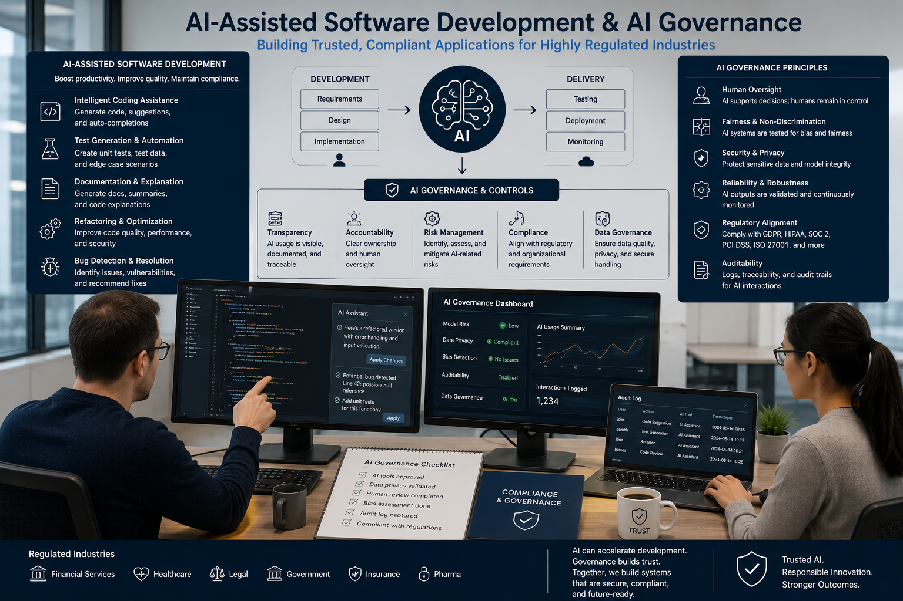

# JavaScript Everywhere – Part 4: Applications for Highly Regulated Industries - AI-Assisted Software Development and AI Governance



_In parts 1, 2, and 3, we discussed—hopefully comprehensively and competently—issues related to programming_ 
_using tools originally designed for front-end development within highly regulated environments._

_Now, in Part 4, we will continue discussion, specifically addressing AI as part of the software engineering lifecycle rather than as a code generator._

_To begin with, let us recall a few truisms._

---

# AI Throughout the Software Development Lifecycle

AI can contribute at nearly every stage of software development.

```text
Business Requirements
        │
        ▼
Architecture Design
        │
        ▼
Threat Modelling
        │
        ▼
Implementation
        │
        ▼
Testing
        │
        ▼
Security Review
        │
        ▼
Documentation
        │
        ▼
CI/CD
        │
        ▼
Operations
        │
        ▼
Continuous Improvement
```

> [!NOTE]
> 📌  The role of AI is to improve productivity and engineering quality while preserving human oversight over every significant technical decision.

---

# AI-Assisted Software Development and AI Governance

> [!IMPORTANT]
> 📌  Artificial Intelligence should be regarded as an engineering accelerator rather than an engineering authority. 
> In highly regulated environments, AI may assist software development, 
> but responsibility for architecture, security, compliance, and correctness always remains with qualified engineers.

AI is rapidly changing software engineering by assisting developers throughout the software development lifecycle. 
Rather than simply generating source code, modern AI systems can support architecture design, documentation, testing, code review, migration, and operational analysis.

Like any other engineering tool, however, AI introduces new technical, operational, legal, and governance challenges that must be addressed systematically.

## AI-Assisted Architecture

AI can assist architects by:
* generating architectural alternatives
* identifying coupling
* proposing design patterns
* documenting architectural decisions
* detecting missing non-functional requirements
* reviewing API designs
* identifying architectural inconsistencies

> [!NOTE]
> 👉  Architecture, however, remains a human responsibility because architectural decisions involve business trade-offs, 
> organisational constraints, regulatory obligations, and long-term maintainability.


## AI-Assisted Development

AI can accelerate implementation by assisting with:
* code generation
* refactoring
* documentation
* API development
* SQL generation
* migration scripts
* infrastructure-as-code
* repetitive implementation tasks

> [!NOTE]
> 👉  Generated code should always satisfy the same engineering standards as manually written software.

AI-generated code should never bypass:
* code review
* static analysis
* security scanning
* automated testing
* architectural review

## AI-Assisted Testing

AI can significantly increase test coverage by generating:
* unit tests
* integration tests
* contract tests
* edge-case scenarios
* regression tests
* property-based test inputs
* test documentation

> [!NOTE]
> 👉  Generated tests should themselves be reviewed to ensure they validate business requirements rather than merely reproducing the implementation.

> [!WARNING]
> ❗️  Testing remains evidence of correctness-not evidence that AI produced syntactically valid code.

## AI-Assisted Security

AI can support security engineering by assisting with:

* threat modelling
* secure coding recommendations
* dependency analysis
* vulnerability identification
* security documentation
* policy verification

> [!WARNING]
> ❗️  Security decisions should always be confirmed through established engineering practices, including security reviews, penetration testing, and automated scanning.

> [!NOTE]
> 👉  AI should assist security engineers rather than replace them.

---

# Human Accountability

One of the most important governance principles is accountability.

Regardless of how software is produced:
* engineers remain responsible
* architects remain responsible
* reviewers remain responsible
* organisations remain responsible

> [!WARNING]
> ❗️  AI cannot assume legal, contractual, or professional responsibility for engineering decisions.

> [!WARNING]
> ❗️  Every production change should therefore have an accountable human approver.

## Reviewing AI-Generated Code

AI-generated software should be treated exactly like contributions from a new team member.

Every change should undergo:
* architectural review
* peer review
* static analysis
* dependency scanning
* automated testing
* security review
* compliance verification

> [!NOTE]
> 👉  The source of the code does not change the required engineering process.

## Managing Hallucinations

AI occasionally produces code that appears plausible but is technically incorrect.

Examples include:
* non-existent APIs
* incorrect framework usage
* insecure implementations
* invalid algorithms
* fabricated documentation references

These risks can be mitigated through:
* independent verification
* automated testing
* compiler validation
* static analysis
* security scanning
* peer review

> [!WARNING]
> ❗️  Engineering evidence should always take precedence over AI confidence.

---

# Protecting Confidential Information

Highly regulated organisations should establish clear policies governing information shared with AI systems.

Examples include:
* client information
* legal documents
* source code
* authentication secrets
* cryptographic keys
* internal architecture
* personally identifiable information (PII)

> [!WARNING]
> ❗️  Confidential information should only be processed using AI services approved by the organisation's security and legal teams.

> [!IMPORTANT]
> 📌  Prompt contents should be treated as business information rather than disposable conversations.

## Prompt Governance

Prompts increasingly become engineering artefacts.

> [!WARNING]
> ❗️  Organisations should manage important prompts using the same discipline applied to source code.

Recommended practices include:
* version control
* peer review
* ownership
* documentation
* approval workflows
* change history

> [!WARNING]
> ❗️  Prompt engineering should be reproducible rather than dependent upon individual developers.

## Decision Provenance

In enterprise software engineering, it is not sufficient to record **what** decision was implemented. It is equally important to understand **why** that decision was made.

> [!IMPORTANT]
> 📌  AI-generated recommendations should therefore be regarded as engineering inputs rather than engineering decisions.

Significant architectural, security, or compliance decisions should include documented human rationale explaining whether an AI recommendation was:
* accepted
* modified
* rejected

Decision records may include:
* the engineering problem
* alternative approaches considered
* AI recommendations (where relevant)
* human evaluation
* justification for the selected approach
* identified trade-offs
* approval by the responsible engineer or architect

> [!NOTE]
> ✔ This creates **decision provenance**, enabling future engineers, auditors, and reviewers to understand not only the resulting implementation but also the reasoning that produced it.

> [!IMPORTANT]
> 📌  AI may contribute ideas, but responsibility for architectural and engineering decisions remains with qualified professionals.

---

# AI-Assisted Verification

> [!IMPORTANT]
> 📌  The greatest long-term value of Artificial Intelligence in highly regulated software may not be automatic code generation, but continuous verification of engineering artefacts.

> [!NOTE]
> ✔ Rather than replacing software engineers, AI can strengthen existing engineering processes by reviewing work products throughout the software development lifecycle.

Examples include:
* reviewing pull requests
* identifying architectural inconsistencies
* generating additional unit and integration tests
* proposing edge-case scenarios
* identifying missing security controls
* reviewing API contracts
* detecting documentation inconsistencies
* analysing configuration changes
* identifying potential compliance gaps
* suggesting observability improvements
* validating Infrastructure-as-Code
* reviewing database migration scripts

Unlike implementation, verification provides an independent perspective that helps identify defects before software reaches production.

This complementary role aligns naturally with established engineering assurance activities such as peer review, static analysis, security assessment, and automated testing.

> [!IMPORTANT]
> 📌  The objective of AI-assisted verification is not to replace human reviewers, but to increase the probability of identifying defects, 
> inconsistencies, security weaknesses, and compliance risks before deployment.

A mature engineering organisation should therefore regard AI as an additional verification layer operating alongside 
traditional quality assurance practices rather than as an autonomous software developer.

```text
Business Requirements
         │
         ▼
Architecture Review
         │
         ▼
Human Design
         │
         ▼
AI Review
         │
         ▼
Implementation
         │
         ▼
AI Verification
         │
         ▼
Human Code Review
         │
         ▼
Static Analysis
         │
         ▼
Automated Testing
         │
         ▼
Security Verification
         │
         ▼
Compliance Verification
         │
         ▼
Production
```

## Reproducibility and Traceability

Enterprise engineering requires reproducible development processes.

Where AI materially contributes to implementation, organisations should retain sufficient evidence to demonstrate:
* which AI tool was used
* which model version was used
* when it was used
* who reviewed the result
* which tests verified the implementation
* which commit introduced the change

This information strengthens traceability without requiring storage of every interactive conversation.

## AI and Continuous Integration

> [!NOTE]
> ✔  AI-generated code should enter exactly the same CI/CD pipeline as manually written code.

```text
AI-Assisted Change
        │
        ▼
Developer Review
        │
        ▼
Static Analysis
        │
        ▼
Dependency Scanning
        │
        ▼
Security Testing
        │
        ▼
Automated Tests
        │
        ▼
Compliance Verification
        │
        ▼
Human Approval
        │
        ▼
Deployment
```

No deployment path should bypass established engineering controls because AI participated in implementation.

---

# AI Governance Principles

Enterprise AI governance should define:
* approved AI platforms
* permitted data classifications
* acceptable use policies
* human approval requirements
* documentation expectations
* security controls
* audit requirements
* model lifecycle management
* incident response procedures

> [!NOTE]
> ✔  AI governance should integrate naturally with existing software engineering governance rather than operate as an isolated process.

---

# Enterprise AI Engineering Checklist

A mature organisation should establish policies covering:
* approved AI tools
* secure prompt handling
* confidential data protection
* prompt version control
* human accountability
* mandatory peer review
* static analysis
* comprehensive automated testing
* security verification
* compliance verification
* auditability
* reproducibility
* continuous monitoring

> [!NOTE]
> 📌  These controls ensure that AI accelerates engineering without weakening security, quality, or regulatory compliance.

---

# Engineering Principle

> [!NOTE]
> ✔ _Artificial Intelligence should reduce the duplication of engineering effort while increasing the duplication of engineering verification._

Source code may be generated once, but its correctness should be confirmed independently through multiple complementary mechanisms, 
including static analysis, automated testing, architectural review, security verification, observability, compliance assessment, and human judgement.

---

# Final Recommendation

> [!NOTE]
> ✔ Artificial Intelligence is most valuable when it augments disciplined engineering rather than replacing it. 
> Organisations building enterprise backend systems with _JavaScript_ and _TypeScript_ should integrate AI into existing architecture, 
> security, testing, compliance, and governance processes instead of creating parallel development practices. 

> [!NOTE]
> 📌 The objective is not autonomous software development, but more productive, more consistent, and better governed software engineering.

> [!NOTE]
> ✔ Engineering discipline, governance, and verification—not automation alone—are what make enterprise backend systems trustworthy.

> [!IMPORTANT]
> 📌  The message I would expect to resonate with senior architects and security engineers is that
> **AI is most valuable when it amplifies verification and assurance, not when it bypasses them**.

---

## See also:
1. [Open Standards for Government](https://www.gov.uk/government/publications/open-standards-for-government)
2. [Open standards for government data and technology](https://www.gov.uk/government/collections/open-standards-for-government-data-and-technology)
3. [A guide to good practice for digital and data-driven health technologies](https://www.gov.uk/government/publications/code-of-conduct-for-data-driven-health-and-care-technology/initial-code-of-conduct-for-data-driven-health-and-care-technology)
4. [UK Government Publishes Guidelines for Artificial Intelligence Procurement](https://www.bevanbrittan.com/insights/articles/2020/uk-government-publishes-guidelines-for-artificial-intelligence-procurement/)
5. [Dependabot quickstart guide](https://docs.github.com/en/code-security/tutorials/secure-your-dependencies/dependabot-quickstart)

## See:
- [JavaScript Everywhere – Part 1: Applications for Highly Regulated Industries (e.g., for Lawyers)](https://www.linkedin.com/pulse/javascript-everywhere-part-1-applications-highly-regulated-kubis-dcxie/)
- [JavaScript Everywhere – Part 2: Applications for Highly Regulated Industries - Compliance and Governance](https://www.linkedin.com/pulse/javascript-everywhere-part-2-applications-highly-regulated-kubis-wc0je/)
- [JavaScript Everywhere – Part 3: Applications for Highly Regulated Industries - Auditability, Testing, CI/CD, Observability](https://www.linkedin.com/pulse/javascript-everywhere-part-3-applications-highly-regulated-kubis-ruwne/)

- [Availability vs Identity in Distributed C#/.NET Applications - Part 1: The Role of Availability and Identity](https://www.linkedin.com/pulse/availability-vs-identity-distributed-cnet-part-1-role-marek-kubis-xvpze/)
- [Availability vs Identity in Distributed C#/.NET Applications - Part 2: Lock-in on Use Cases and on Cloud](https://www.linkedin.com/pulse/availability-vs-identity-distributed-cnet-part-2-lock-in-kubis-zhmee/)

- [What is managed identities for Azure resources?](https://learn.microsoft.com/en-us/azure/active-directory/managed-identities-azure-resources/overview)
- [IAM Roles](https://docs.aws.amazon.com/IAM/latest/UserGuide/id_roles.html)
- [Authenticate to Google Cloud APIs from GKE workloads](https://cloud.google.com/kubernetes-engine/docs/how-to/workload-identity)
- [What is Azure role-based access control (Azure RBAC)?](https://learn.microsoft.com/en-us/azure/role-based-access-control/overview)

- [Once and Only Once with Examples - Part 1: Is It Obvious?](https://www.linkedin.com/pulse/once-only-examples-part-1-obvious-marek-kubis-nyebe/)
- [Once and Only Once with Examples - Part 2: And AI-generated Code](https://www.linkedin.com/pulse/once-only-examples-part-2-ai-generated-code-marek-kubis-kn9ie/)
- [Once and Only Once with Examples - Part 3: Where Duplication Is Simultaneously Necessary](https://www.linkedin.com/pulse/once-only-examples-part-3-where-duplication-necessary-marek-kubis-vpxce/)

- [Mutation testing - Part 1: is it outdated?](https://lnkd.in/eDbVukCf)
- [Mutation testing - Part 2: Turn into a production-ready tool](https://lnkd.in/eSx9b6pB)
- [Mutation testing - Part 3: Mutation testing limits and how to go beyond it](https://lnkd.in/e3qsTXBy)
- [Mutation testing - Part 4: mutation testing and LLM-written code](https://lnkd.in/eKfvJfbp)

- [Underestimated and Annoying, or the "Dirty Dozen" of Programmers - Part 1: The Problem Space](https://www.linkedin.com/pulse/underestimated-annoying-dirty-dozen-programmers-marek-kubis-mcfxe)
- [Underestimated and Annoying, that is "The Dirty Dozen" of Programmers - Part 2: AI-Generated Software](https://www.linkedin.com/pulse/underestimated-annoying-dirty-dozen-programmers-part-2-marek-kubis-tqkme/)
- [Underestimated and Annoying, that is "The Dirty Dozen" of Programmers - Part 3: I. Organizational Problems](https://www.linkedin.com/pulse/underestimated-annoying-dirty-dozen-programmers-part-marek-kubis-h9y3e/)
- [Underestimated and Annoying, that is "The Dirty Dozen" of Programmers - Part 4: II. Human Problems](https://www.linkedin.com/pulse/underestimated-annoying-dirty-dozen-programmers-part-marek-kubis-mn5ve/)
- [Underestimated and Annoying, that is "The Dirty Dozen" of Programmers - Part 5: III. Process Problems](https://www.linkedin.com/pulse/underestimated-annoying-dirty-dozen-vibe-coding-part-marek-kubis-83jre/)
- [Underestimated and Annoying, that is "The Dirty Dozen" of Programmers - Part 6: IV. Architecture Problems](https://www.linkedin.com/pulse/underestimated-annoying-dirty-dozen-programmers-part-marek-kubis-remze/)
- [Underestimated and Annoying, that is "The Dirty Dozen" of Programmers - Part 7: V. Validation Problems](https://www.linkedin.com/pulse/underestimated-annoying-dirty-dozen-programmers-part-marek-kubis-dqk2e/)
- [Underestimated and Annoying, that is "The Dirty Dozen" of Programmers - Part 8: VI. Economic Problems](https://www.linkedin.com/pulse/underestimated-annoying-dirty-dozen-programmers-part-marek-kubis-7bb6e/)

- [Murphy’s law and more in AI time - one by one with examples](https://www.linkedin.com/pulse/murphys-law-more-ai-time-one-examples-marek-kubis-fkaze)
- [The Agile Vibe Coding and Conway's Law](https://www.linkedin.com/pulse/agile-vibe-coding-conways-law-marek-kubis-m0wpe)
- [Using a digital banking solution to prove Conway’s Law in AI-Driven engineering - example 1](https://www.linkedin.com/pulse/using-digital-banking-solution-prove-conways-law-ai-driven-kubis-xqlre/)
- [Using a .NET 10 migration project to prove Conway’s Law in AI-Driven engineering - example 2](https://www.linkedin.com/pulse/using-net-10-migration-project-prove-conways-law-ai-driven-kubis-abqae)

- [Where traditional Agile breaks in AI-driven systems](https://www.linkedin.com/pulse/where-traditional-agile-breaks-ai-driven-systems-marek-kubis-4wq6e/)
- [AI - It seems nobody has it fully figured out yet](https://www.linkedin.com/pulse/ai-nobody-has-figured-out-marek-kubis-bkyge)
- [Internal Development Platform and Agile Vibe Coding](https://www.linkedin.com/pulse/internal-development-platform-agile-vibe-coding-marek-kubis-kyhqe/?trackingId=5w3lWKp%2F0BLUpwNdrSmAcg%3D%3D&lipi=urn%3Ali%3Apage%3Ad_flagship3_pulse_read%3BqH%2FwqbkZRkmo%2Fagtxvqyrw%3D%3D)
- [Everyone will be vibe coders](https://www.linkedin.com/pulse/everyone-vibe-coders-marek-kubis-tlgze)
- [The Structural problems AI introduces into the SDLC](https://www.linkedin.com/pulse/structural-problems-ai-introduces-sdlc-marek-kubis-qyt6e)
- [Signals That Reveal the True Maturity of Organisations Claiming “AI-Driven Development”](https://www.linkedin.com/pulse/signals-reveal-true-maturity-organisations-claiming-ai-driven-kubis-urule)

- [Agile Vibe Coding positioning and if this works, what changes?](https://www.linkedin.com/pulse/agile-vibe-coding-positioning-works-what-changes-marek-kubis-r4ate)
- [Agile Vibe Coding – Ceremony Modes](https://www.linkedin.com/pulse/agile-vibe-coding-ceremony-modes-marek-kubis-meq9e)
- [Agile Vibe Coding ceremonies approach compared to a simple one-prompt-per-task approach](https://www.linkedin.com/pulse/agile-vibe-coding-ceremonies-approach-compared-simple-marek-kubis-ecx5e)
- [Agile Vibe Coding Maturity Model](https://www.linkedin.com/pulse/agile-vibe-coding-maturity-model-marek-kubis-bbtqe)
- [The Agile Vibe Coding - the 4-level adaptive ceremony system](https://www.linkedin.com/pulse/agile-vibe-coding-4-level-adaptive-ceremony-system-marek-kubis-jizke)

- [Agile Vibe Coding Manifesto](https://agilevibecoding.org/)
- [Principles Behind the Agile Vibe Coding Manifesto - extended version](https://github.com/marekartur-dev/agilevibecoding/blob/main/Docs/Home/Principles.md)

- [Agile Vibe Coding](https://www.reddit.com/r/AgileVibeCoding/)
- [Marek Kubis - blog](https://github.com/marekartur-dev/agilevibecoding/tree/main)
