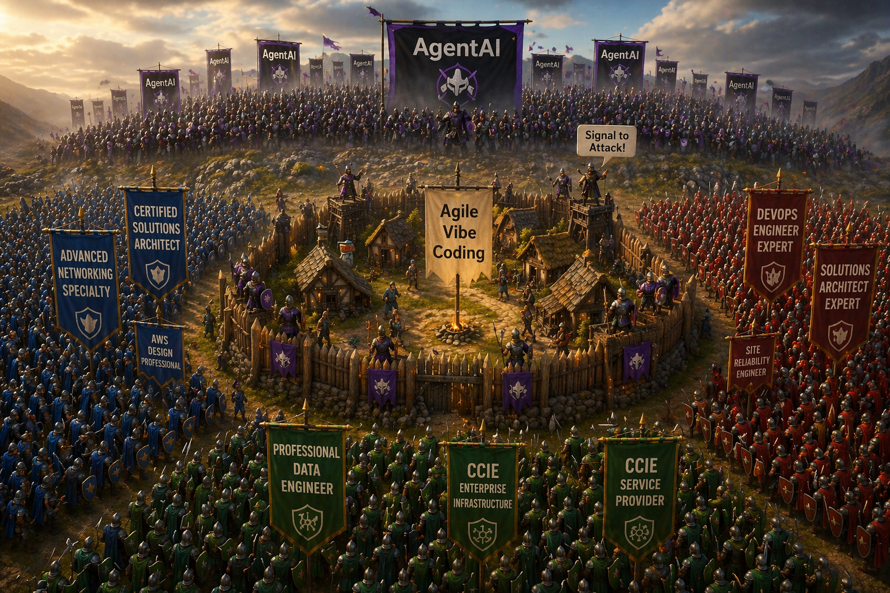

# Kafka & Service Bus — Part 2: In Business Solutions
_Realistic experience-based numbers to anchor production systems_



> In Part 1, we compared Kafka and Service Bus from a technical perspective.
> In Part 2, we’ll look at real-world business systems and how these technologies fit into their architectures.
 
When designing software, we must keep in mind the current impact of artificial intelligence (AI) 
which is shifting the development process from coding to orchestration and configuration. 
AI-driven development increases the importance of clear architectural boundaries (e.g., Kafka vs Service Bus), 
because systems are increasingly composed rather than coded.

> Application Requirements Document (ARD) design becomes crucial in this context, and I deliberately included 
selected design elements that were coding-ready but also served as guides for AI prompts.  

**Mental model for each example:**
- Service Bus → “systems coordinate work”
- Kafka → “systems share and analyze data”

## Sales / eCommerce app
_(orders, payments, inventory updates)_

- Messages/sec: 50 → 5,000 (peaks during promos can hit ~10k)
- Message size: 1–10 KB
- Consumers: 5–20 services
  (billing, inventory, shipping, notifications, analytics)

### Architecture pattern: Service Bus–centric

> Goal: reliable order processing, payments, inventory, notifications.

```
    Clients → API Gateway → .NET APIs
                ↓
         Azure Service Bus (Topics)
                ↓
     Kubernetes (.NET Workers)
                ↓
        SQL / Redis / External APIs
```

### Key Design Choices
- Use Service Bus Topics: orders, payments, inventory
- Subscriptions per service (fan-out)

### Scaling
- Service Bus Premium: 2–4 Messaging Units
- Kubernetes: 10–30 pods per service
- Throughput: up to ~10k msg/sec

### Critical Patterns
- Idempotency (orders must not duplicate)
- Dead-letter queues
- Saga pattern (order workflow)

**👉 Fit:**
- ✅ Azure Service Bus is usually enough
- ❌ Apache Kafka overkill unless large-scale marketplace
- ❌ Kafka not needed initially
- ✅ Add Kafka later for analytics (clickstream, recommendations)


## MRP / ERP (manufacturing systems)
_(machine events, stock levels, work orders)_

- Messages/sec: 100 → 10,000
- Message size: 1–5 KB
- Consumers: 10–50 services
  (planning, procurement, warehouse, reporting)

**👉 Fit:**
- ✅ Service Bus for workflows
- ⚠️ Kafka useful if factories generate continuous telemetry or need historical replay

### Architecture pattern: Hybrid

> Goal: Workflow + machine/event telemetry

```
    Machines / APIs
          ↓
     Azure Functions / APIs
          ↓
 ┌────────┴───────┐
 ↓                ↓
Service Bus      Kafka
(workflows)      (telemetry/events)
 ↓                ↓
ERP Workers      Stream Processing
                 (analytics, ML)
```

### Key Design Choices

**Service Bus:**
- Work orders
- Procurement

**Kafka:**
- Machine telemetry
- Production metrics

### Scaling
- Service Bus: **4–8 MU**
- Kafka: 6–12 partitions per topic & 3+ brokers recommended for high availability

### Kubernetes
- Workers: 20–50 pods
- Stream processors (Kafka consumers)

### Critical Patterns
- Event sourcing (optional)
- CQRS separation
- Backpressure handled via consumer lag and retention buffering

## Warehouse Management Systems (WMS)

### Small Warehouse Architecture (Service Bus–centric)

> Goal: Inventory updates, picking, shipping, barcode scans.

```
   Handheld Scanners / WMS UI
        ↓
   API Layer (.NET)
        ↓
   Azure Service Bus (Queues/Topics)
        ↓
   Kubernetes Workers
        ↓
   SQL / ERP / External Systems
```

### Typical Load
- Messages/sec: 20 → 500
- Message size: 1–5 KB
- Consumers: 3–10

### Scaling
- Service Bus: 1–2 MU
- Kubernetes: 5–15 pods

### Key Patterns
- Command-driven PickItem & UpdateStock
- Strong consistency required
- Retry + Dead Letter Queue, DLQ critical

### Kafka?
- ❌ Not needed

> 👉 This is classic workflow messaging, perfect for Azure Service Bus.

### Large Warehouse / Fulfillment Center Hybrid Architecture
_(think Amazon-style automation, robotics, IoT)_

> Goal: High-frequency scanning + robotics + telemetry + optimization

```
Robots / Scanners / IoT
         ↓
      Gateway / APIs
         ↓
 ┌───────┴────────┐
 ↓                ↓
Service Bus      Kafka
(commands)       (telemetry/events)
 ↓                ↓
WMS Workers      Real-time Optimization / ML
```
### Typical Load
- Messages/sec: 5,000 → 50,000
- Message size: 0.5–3 KB
- Consumers: 10–40

### Responsibilities split
**Service Bus**
- Order fulfillment workflows
- Picking / packing commands
- Shipment coordination

### Kafka
- Robot telemetry
- Conveyor belt events
- Heatmaps / optimization

### Scaling
**Service Bus**
- 4–8 MU

**Kafka**
- 12–30 partitions
- 3–6 brokers

### Kubernetes
- 30–100 pods

### Critical Patterns
- Real-time optimization loops
- Backpressure via Kafka
- Event replay for debugging warehouse issues


## Retail Distributed Network (Online Transaction Monitoring)
_(think: many stores + POS + central monitoring system)_

> Goal: Monitor transactions across hundreds/thousands of stores in real time:

- fraud detection
- sales dashboards
- anomaly detection

### Small / Medium Retail Network

✅ Architecture (Service Bus + optional light streaming)
```
   POS Systems 
        ↓
   API / Gateway
        ↓
   Azure Service Bus (Topics)
        ↓
   Monitoring + Fraud Services
```

### Typical Load
- Messages/sec: 100 → 5,000
- Message size: 1–5 KB
- Consumers: 5–15
- Stores: 10–100 

### Scaling
- Service Bus: 2–4 MU
- Kubernetes: 10–30 pods

### Kafka? 
⚠️ Optional - only if:
- need real-time analytics dashboards
- want historical replay


### Large Retail Network (Enterprise / Global)
_(1000+ stores, Black Friday scale)_

✅ Full Hybrid Architecture (Kafka becomes critical)
```
POS / Online Orders / Mobile Apps
         ↓
     Gateway Layer
         ↓
 ┌───────┴────────┐
 ↓                ↓
Service Bus      Kafka
(transactions)   (event stream)
 ↓                ↓
Order Processing Real-time Analytics / Fraud Detection
                  ↓
          Data Lake / BI / ML
```

### Typical Load
- Messages/sec: 10,000 → 200,000+
- Message size: 1–10 KB
- Consumers: 20–100+

### Responsibilities split

**Service Bus**
- Payment processing
- Order workflows
- Inventory updates

**Kafka**
- Transaction stream (all sales events)
- Fraud detection pipelines
- Real-time dashboards
- Customer behaviour tracking

### Scaling

**Service Bus**
- 8–16 MU

**Kafka**
- 20–100 partitions
- 5–10 brokers

### Kubernetes
- 50–200+ pods

### Critical Patterns

1) Fraud detection pipeline 
`Kafka → stream processor → flag anomalies in milliseconds`

2) Re-run event transactions for:
- audits
- ML model improvements

3) Geo-distribution
- Multi-region deployment
- Event replication (Kafka MirrorMaker-style)


## Warehouses vs Retail difference
```
Aspect	Warehouse	Retail Network
----------------------------------------------------
Nature	Operational	Transactional
Priority	Consistency	Throughput + analytics
Kafka need	Medium (large only)	High (large systems)
```


## Hospital patient monitoring
_(vitals, alarms, device streams)_

Messages/sec:
- Small hospital: 500–2,000
- Large hospital: 5,000–50,000

- Message size: 0.5–2 KB (frequent, small signals)
- Consumers: 5–15
  (alerts, dashboards, storage, ML models)

### Small Hospital Architecture (Service Bus–centric)
```
    Devices → IoT Gateway → Azure Function
                    ↓
             Service Bus
                    ↓
         Alerting + Storage Services
```
**Scaling**
- 1–2 MU
- 5–15 pods
**Why**
- Focus on reliability + alerts
- Not massive data

### Large Hospital Architecture (Hybrid - Kafka strongly recommended)
```
   Medical Devices
         ↓
   IoT Hub / Gateway
         ↓
 ┌───────┴────────┐
 ↓                ↓
Service Bus      Kafka
(alerts)         (vital streams)
 ↓                ↓
Alert Services   Real-time analytics / ML
```

### Key Design Choices
- Service Bus: Critical alerts (guaranteed delivery)
- Kafka: Continuous vitals streaming

### Scaling
- Kafka: 10–20 partitions & 3–6 brokers
- Throughput: up to 50k msg/sec

### Critical Patterns
- Priority handling (alerts first)
- Kafka exactly-once processing (only if strictly required; adds complexity)
- Time-series storage (e.g., data lake)

⚠️ Fit - hybrids work best:
- Service Bus → alerts/workflows
- Kafka → continuous telemetry stream


## Motorway traffic monitoring
_(sensors, cameras, speed, congestion)_

- Messages/sec: 10,000 → 200,000+
- Message size: 0.5–3 KB
- Consumers: 10–30
  (analytics, alerting, control systems, dashboards)
  
Service bus only if needed for:
- Control commands
- Incident workflows

👉 Fit:
- ❌ Service Bus alone may become a bottleneck at very high throughput
- ✅ Kafka becomes the natural choice

### Architecture pattern: Kafka-centric

> Goal: Massive real-time ingestion + analytics

``` 
Sensors / Cameras
      ↓
Edge Gateways
      ↓
Kafka Cluster
      ↓
Stream Processing (Flink / .NET)
      ↓
Dashboards / Alerts / Control Systems
``` 

### Key Design Choices
- Kafka is core backbone
- Topics: vehicle-speed, traffic-density, incidents

### Scaling Kafka:
- 20–100 partitions
- 5–10 brokers
- Throughput: 100k–500k msg/sec

### Kubernetes
- Stream processors: 50–200 pods


## Airport traffic control systems

### Small airport
``` 
Systems → APIs → Service Bus → Workers
``` 
- Messages/sec: 100–1,000
- Message size: 1–5 KB
- Consumers: 5–10

> 👉 ✅ Service Bus is enough → simple + reliable
- 1–2 MU
- 5–10 services

### Medium airport
- Messages/sec: 1,000–10,000
- Message size: 1–5 KB
- Consumers: 10–25

> 👉 ⚠️ Service Bus OK, Kafka optional

### Large international hub
- Messages/sec: 10,000–100,000+
- Message size: 1–10 KB
- Consumers: 20–50+
  (air traffic systems, logistics, security, analytics)

### Full hybrid architecture (mission-critical)
``` 
 Radar / Systems / IoT
         ↓
      Gateway Layer
         ↓
 ┌───────┴────────┐
 ↓                ↓
Service Bus      Kafka
(commands)       (event backbone)
 ↓                ↓
Control Systems  Analytics / Replay / AI
``` 

### Key Design Choices
Service Bus
- Flight coordination
- Ground operations
- Security workflows

Kafka
- Aircraft telemetry
- Radar streams
- Historical replay

### Scaling
Kafka
- 50–200 partitions
- 6–12 brokers
- 100k+ msg/sec
Service Bus
- 8–16 MU

### Kubernetes
- 100+ pods across services

### Critical Patterns
- Event replay (incident investigation)
- Geo-redundancy
- Strict ordering (partition keys: aircraft ID)


> 👉 ✅ Hybrid strongly recommended
> - Service Bus → control workflows
> - Kafka → real-time event backbone


## Pattern we should notice

When Service Bus dominates:
- Lower throughput (< ~20k msg/sec)
- Simpler operations preferred
- Strong reliability needed
- Command-driven workflows
- Moderate scale
- Fewer consumers

When Kafka becomes necessary:
- High throughput (> ~50k msg/sec)
- Continuous event streams
- Events must be replayed
- Many independent consumers
- Replay / analytics required
- Real-time analytics is core, not optional

### Cross-system best practices (VERY important)

1) Idempotency everywhere
```csharp
if (AlreadyProcessed(message.Id)) return;
``` 

2) Retry + Dead Letter Queue, DLQ strategy
- Service Bus → built-in Dead Letter Queue, DLQ
- Kafka → retry topics

3) Observability
- Distributed tracing (OpenTelemetry)
- Kafka Metrics: lag 
- Service Bus Metrics: queue depth

4) Schema management
- Use versioned contracts (JSON/Avro)

5) Kubernetes scaling
- Typical: `replicas: 10 → 200`
- Autoscale based on: CPU & Queue length / Kafka lag

## Common mistakes

- Using Kafka as a task queue
- Using Service Bus for high-volume telemetry
- Introducing Kafka too early
- Ignoring idempotency

## Final comparison across example systems
``` 
System	Messaging backbone
-----------------------------------------------
eCommerce	Service Bus
MRP/ERP	Hybrid
Warehouse (small)	Service Bus
Warehouse (large)	Hybrid
Retail network (small)	Service Bus
Retail network (large)	Hybrid
Hospital (small)	Service Bus
Hospital (large)	Hybrid
Motorway	Kafka
Airport (small)	Service Bus
Airport (large)	Hybrid
``` 

- Service Bus = reliability + workflows
- Kafka = scale + streaming + replay
- Hybrid = real-world enterprise sweet spot


## Practical takeaway

> Kafka optimises throughput; Service Bus optimises reliability and latency consistency.

**⚖️ Simple rule of thumb**
```
(rough order-of-magnitude guidance; workload-dependent)

< 10k msg/sec     → Service Bus
10k–50k msg/sec   → Depends / Hybrid
> 50k msg/sec     → Kafka territory
```

- Sales / ERP → Service Bus first
- Warehouses evolve into Kafka when automation + telemetry grows
- Retail evolves into Kafka when analytics becomes critical
- Service Bus remains the backbone for business correctness
- IoT / telemetry (traffic, hospital streams) → Kafka emerges naturally
- Critical systems → often BOTH

## See also:
- [Kafka & Service Bus — Part 1: Two Philosophies of Event-Driven Systems](./Kafka_and_ServiceBus_Part_1.md)
- [Kafka vs Service Bus Part 3: Real-world Architectures](./Kafka_and_ServiceBus_Part_3.md)


- [Agile Vibe Coding Manifesto](https://agilevibecoding.org/)
- [Principles Behind the Agile Vibe Coding Manifesto - extended version](https://github.com/marekartur-dev/agilevibecoding/blob/main/Docs/Home/Principles.md)

- [Agile Vibe Coding](https://www.reddit.com/r/AgileVibeCoding/)
- [Marek Kubis - blog](https://github.com/marekartur-dev/agilevibecoding/tree/main)

