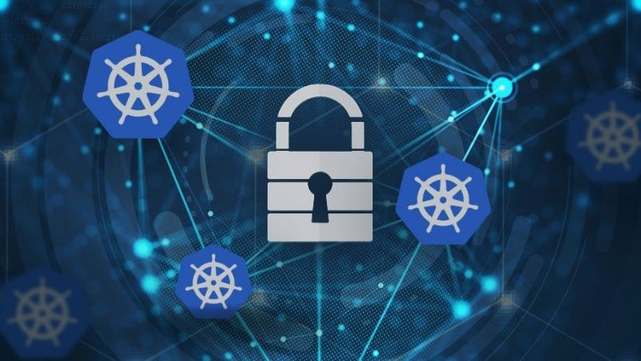
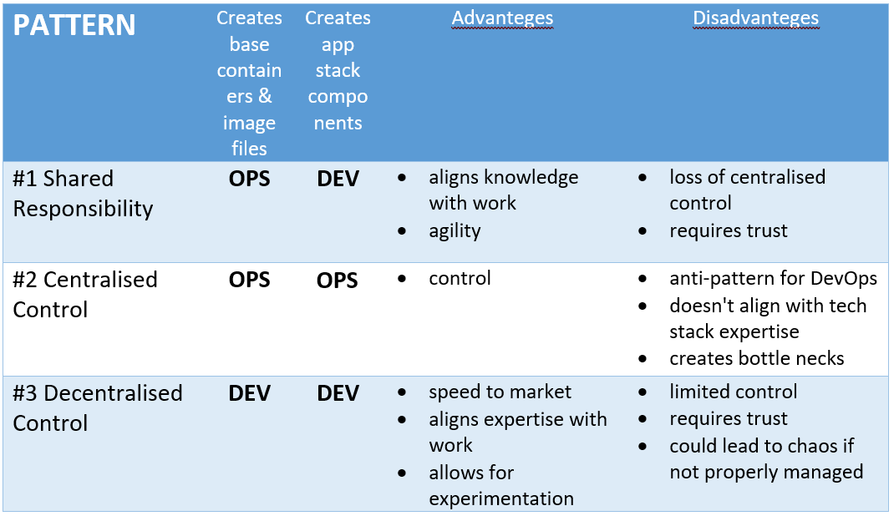

# Kubernetes design decisions

> In software engineering, things get complex quickly. The art of cloud architecture is knowing when to use what and how.

## What’s important

We will not rediscover America in this respect
- Focus on peoples and processes.
- Fool with a tool is still a fool.

So, we still need to drill down into
- **Physical technology and tools**
- **Logical architecture**
- **Applications and personal development**
- **Software abstraction**

To understand how to take these points and apply them to our own problem space, Kubernetes can help us. How? By moving on to the physical solutions, once we first designed our logical architecture.

## Kubernetes, K8s

**Kubernetes** is an abstraction that allow focus on application development vs infrastructure. Also, Kubernetes is a container scheduling and launch platform that automates the deployment, 
scaling, and management of containerized applications. It runs on a physical computer, a virtual machine, a private data centre, and a public cloud.

**Container**, encapsulate the operating system and applications into a single, distributed disk image component that’s able to run on many OS’s and cloud-based platforms. 
The container enables the use of disk images in isolation. Furthermore, this use of components enables easy portability and scalability. In other words, containers are just another way to deploy applications.

### K8s items
- **Containers** run applications.
- **Pods** group container together.
- **Services** make Pods available to others.
- **Labels** are used for very advanced device discovery.

## Moving existing applications to containers

Most applications can run within a container. Sometimes it may be necessary to do a bit of refactoring. 
Sometimes after understanding the requirements, it may turn out that there is no need to package the application into a container. 
It is possible does not mean that we should do it. Just focus on what you will do with the container, not what if will be.

### Advantages
- The containers allow nonportable applications to be portable from cloud to cloud and from platform to platform.
- Moving to containers is generally a good move.

### Disadvantages
- Costs more than just lift and shift.
- More complex in term of DevOps.
- Questions about true value of portability.

## Myths surrounding containers

### Myth #1 – “Just throw everything in a container and move to the cloud.”

Easier said than done. It is necessary to consider:
- the required target storage technologies,
- how to move the data?
- how to provide security?
- how to archive apps and data?
- versioning policy and how does patching change?
- how do audit?

### Myth #2 - “Containers aren’t secure.”

This is an extension of the original concerns about the security of everything in the cloud. The reality is that cloud providers and large ecosystem of security vendors filling gaps. 
Sure, security breaches still happen, but the weakest link today is people, not IT technology.

### Myth #3 - “Kubernetes supports high application availability, so our data is protected.”
The features like auto-scaling and self-healing, this does not inherently guarantee data protection. To safeguard organisations critical data and ensure business continuity their must implement dedicated, 
purpose-built data protection solutions.

### Myth #4 – “Containers simplify deployments.”

Partially true, only when solution architected correctly. Then containers can drastically simplify code push from one environment to another. But why partially? Because the container by itself is not enough.

### Myth #5 - "I already know how to move applications with my traditional solution."
There’s no arguing, but traditional backup and recovery solutions aren’t optimised for containerised applications. It’s predictable that traditional approaches will lead to inefficiencies in migration processes. 
Furthermore, K8s applications still depend on other resources and data outside of the containerised image. This requires purpose-built, 
customised cloud native solutions and expert knowledge of the intricacies of container orchestration.

## In summary

### Networking in brief
- Ethernet moves “frames” on a wire or WiFi.
- IP layer moves packets on a local network.
- Routing forwards packets between networks.
- Ports address particular programs on a computer.
- Namespaces is used to contain networks.

### K8s key features
- **Automated Scaling**: Adjusts the number of running containers based on demand.
- **Self-healing**: Restarts failed containers, replaces unhealthy ones, and reschedules them if a node fails.
- **Load Balancing & Service Discovery**: Distributes traffic among containers and provides internal service discovery.
- **Rolling Updates & Rollbacks**: Deploy new versions of applications with minimal downtime.
- **Storage Orchestration**: Manages storage resources for containers.
- **Multi-cloud & Hybrid Support**: Works across on-premise, cloud, and hybrid environments.

### Pipelines create in brief

