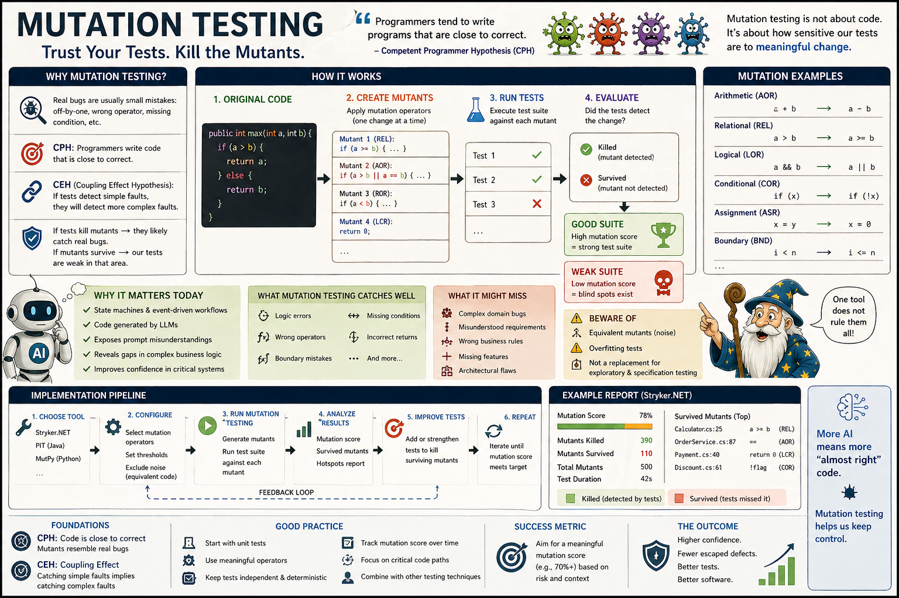

# Mutation testing - Part 1: is it outdated?



### Mutation testing map

The increasing complexity of software has always been a constant companion for programmers. However, the recent acceleration brought about by artificial intelligence should force us to rethink 
how to maintain the principles of good software engineering without losing control over our systems.
[Martin Fowler](https://www.linkedin.com/feed/update/urn:li:activity:7452365511214067712/) highlighted this in the latest issue of [Technology Radar, Volume 34 | April 2026](https://www.thoughtworks.com/radar). 

The Thoughtworks Technology report highlights several important aspects, but I want to focus on just one: **mutation testing**.

We should thank the report's authors for reminding us about this technique.

Have you ever experienced the feeling that, while writing tests, something important might still be missing? And when, despite careful test design, the program produced unexpected errors - did that feeling grow?

So what kinds of errors can hide from unit, integration, system, acceptance, exploratory, manual, or automated tests?

A confident Tech Lead might say that errors go undetected because tests are poorly written or not comprehensive enough - and recommend relearning testing fundamentals. That’s partly true, but not the whole story. 
It’s worth revisiting a technique developed alongside the foundations of modern software engineering.

Much has changed since 1971, when Richard Lipton published “Mutant Testing of Programs”. It’s no surprise that mutation testing has been overshadowed by other techniques rather than continuously refined.

> Since there is no perfect solution, it is worth rediscovering mutation testing and adding it to our engineering toolbox.


## What are mutation tests designed to detect?

To understand the idea of ​​mutation testing, it is necessary to understand two closely related hypotheses.
1. The **Competent Programmer Hypothesis**, CPH.
2. The **Coupling Effect Hypothesis**, CEH.

Re: **CPH** comes from early work by Richard Lipton and Alan Perlis and states:
> Programmers tend to write programs that are close to correct.

This means that real bugs are usually:
- small mistakes,
- local changes,
- off-by-one errors,
- wrong operators (`>= → >`, `== → !=`, `+ → -`),

and not:
- completely broken systems,
- random, nonsensie code.

And if so, even minor changes (mutants), such as `&& → ||`, are sufficient to conduct testing. These small mutations resemble real bugs, so
- if our tests detect mutants, they will likely also detect serious logical or computational errors.
- if they don't, our tests are weak,
- if the test suite detects a change (i.e., one of the tests fails), then the mutant is said to have been eliminated.

Re: **CEH** is based on the idea that simple faults can cascade or combine to form other, emergent faults. 
- Because higher-order mutants also reveal subtle and significant errors, further supporting the linkage effect. 
- Test cases that detect simple faults are also effective at detecting more complex faults.
- The coupling effect justifies the thesis that **it is enough to test simple mutants**.

### Practical interpretation

> Mutation testing works because real bugs are small deviations and because catching small deviations implies catching larger ones.

So, when we run mutation testing and
- mutant survived then **“our tests miss a realistic bug”**,
- mutant killed then **“our tests are sensitive to that class of errors”**.
 
Important to remember.
- If the programmers wrote completely incorrect code, a completely broken system, then no tests will help detect places with errors, so testing not only mutations is pointless.
- Mutation testing involves selecting a set of mutation operators and then applying them to the source program, one for each relevant fragment of the source code.
- It's possible write equivalent mutants that are different in syntax but not in behaviour, so they will not be detected by tests → noise.
- We can write tests that kill mutants, but don’t reflect real behaviour → overfitting tests.
- LLMs also produce “almost correct” code.

Mutation testing is especially relevant in a context of:
- state machines (stateless),
- event-driven workflows,
- code generated by LLM,
- exposing prompt misunderstandings.

However, mutation testing may fail to detect:
- complex domain errors,
- misunderstood requirements → logic gaps,
- wrong business rules,
- missing features.

> [!Important]
> Mutation testing is not about code. It’s about **how sensitive our tests are to meaningful change**.
> 
> Furthermore, our **mutation tests are based on hypotheses and reasonable assumptions**, not on proven claims.

### So what’s the real advantage?

1) **Measures test quality, not quantity**.
> We can have 100 tests that all pass—but still miss critical logic errors.
Mutation testing tells us **“Our tests look thorough, but they don’t actually protect this logic”**.

2) **Finds blind spots automatically**

> Humans are bad at spotting all edge cases. Mutation testing systematically probes them.
In human case, it forces the question: **“Did you test the exact boundary?”**

3) **Prevents false confidence**

- Without mutation testing: “All tests passed” can mean “we didn’t test the important thing.”
- With mutation testing: **“Mutants killed” means “tests would catch real mistakes.”**

### Trade-offs

<pre><code>	
Approach	Strength	Weakness
------------------------------------------------------------------------------
Many unit tests	Fast, simple	Can miss important cases
Mutation testing	Validates test effectiveness	Slower, more compute-heavy
</code></pre>


## More complex cases than a simple boundary tests

### Discount logic example

```python
def calculate_discount(user_type, purchase_amount):
    if user_type == "VIP":
        if purchase_amount >= 100:
            return 0.2
        else:
            return 0.1
    else:
        if purchase_amount >= 100:
            return 0.1
        else:
            return 0.0
```
Intended business rules:
- VIP + ≥100 → 20%
- VIP + <100 → 10%
- Regular + ≥100 → 10%
- Regular + <100 → 0%

### A “reasonable” test suite (but flawed)

```python
def test_vip_high():
    assert calculate_discount("VIP", 150) == 0.2

def test_regular_low():
    assert calculate_discount("Regular", 50) == 0.0

def test_regular_high():
    assert calculate_discount("Regular", 150) == 0.1
```
Tests cover:
- VIP
- Regular
- High and low amounts

___Do you agree that it looks decent?___

### Now introduce some mutants

#### Mutant 1: boundary change

```
- if purchase_amount >= 100:
+ if purchase_amount > 100:
```

Result? → **Survives! → Why? → We never tested exactly 100.**

#### Mutant 2: wrong discount for VIP low spend

```
- return 0.1
+ return 0.0
```

Result? → **Survives! → Why? → We never tested VIP with <100.**

#### Mutant 3: wrong user type condition

```
- if user_type == "VIP":
+ if user_type != "VIP":
```

Result? → **Might partially survive depending on coverage.**

> **If our tests don’t strongly distinguish behaviours, this can slip through.**

### What mutation testing reveals?

Even though our tests:
- Cover multiple scenarios
- Use different inputs

They **miss critical combinations and boundaries**:
- VIP + low amount
- Exact boundary (100)

### Improved test suite (guided by mutation testing)

```python   
def test_vip_high():
    assert calculate_discount("VIP", 150) == 0.2

def test_vip_boundary():
    assert calculate_discount("VIP", 100) == 0.2

def test_vip_low():
    assert calculate_discount("VIP", 50) == 0.1

def test_regular_high():
    assert calculate_discount("Regular", 150) == 0.1

def test_regular_boundary():
    assert calculate_discount("Regular", 100) == 0.1

def test_regular_low():
    assert calculate_discount("Regular", 50) == 0.0
```

Now:
- All mutants above are killed.
- We’ve explicitly encoded boundaries and combinations of conditions.

### Why this matters more in real systems?

In simple functions like `is_adult`, the missing edge case is obvious.
```python
def is_adult(age): return age >= 18
```

But in real code:
- Multiple conditions interact.
- Logic branches multiply quickly.
- Humans systematically miss combinations.

> Mutation testing exposes: **“We tested values — but not behaviours across dimensions”**.

In the example with `calculate_discount`, we can test a few random amounts (50, 150).
But is very easy to miss:
- boundary (100),
- combinations (`VIP` vs `Regular` at each level).

> Mutation testing ensures we **don’t just test the inputs** …but instead: **the correctness of decision logic**

### A practical way to use mutation testing

> We don’t need to run mutation testing everywhere.

A common strategy:
- run normal unit tests in CI (fast)
- run mutation testing nightly.
- or run on critical modules only


## A real-world style scenario  

> Let's consider an example where mutation testing catches something that _dozens of ordinary tests_ could easily miss.

### Scenario: Payment eligibility logic

```python
def can_process_payment(balance, amount, is_verified):
    if not is_verified:
        return False
    
    if balance >= amount:
        return True
    else:
        return False
```

Business rule:
- User must be verified
- Must have **enough balance** (including exact match)

### A “solid” test suite (typical in real projects)

```python   
def test_verified_with_enough_balance():
    assert can_process_payment(200, 100, True) == True

def test_verified_with_insufficient_balance():
    assert can_process_payment(50, 100, True) == False

def test_unverified_user():
    assert can_process_payment(200, 100, False) == False
```

This looks good:
- Covers verified/unverified
- Covers enough/not enough balance
- Uses realistic values

> Most teams would stop here.

### Now introduce a subtle bug (mutation)

```
- if balance >= amount:
+ if balance > amount:
```

### What happens?

- Our tests still pass. Why?

```
Case	balance	amount	Result (original)	Result (mutant)
-----------------------------------------------------------
Test 1	200	100	True	True
Test 2	50	100	False	False
Test 3	200	100	False (unverified)	False
```

> **The bug is completely invisible**.

- Now imagine a real user:

```
can_process_payment(100, 100, True)
```

The real bug in production: 
- Original → ✅ True (allowed)
- Mutant → ❌ False (rejected)

### Impact

This kind of bug can cause:
- Failed payments at exact balance
- Customer frustration
- Support tickets like: **“I have enough money — why is it failing?”**

And it’s subtle:
- Only happens at exact equality
- Rare compared to other values
- Easy to miss in manual thinking

### Why unit tests missed it?

Because humans tend to test:
- **“Clearly enough”** → 200 vs 100
- **“Clearly not enough”** → 50 vs 100
- But forget → **“Exactly equal”**

### How does it force better tests?

> **Use a tool** like Stryker to automatically generate mutants and run tests against them.

Since tests still pass, mutation testing reports:
- ⚠️ Surviving mutant: our tests didn’t catch this logic change
- and prompts us to add a test for the boundary case:
```python
def test_verified_with_exact_balance():
    assert can_process_payment(100, 100, True) == True
```

So, 
- Without mutation testing we verify: **“Does the code work for the cases I thought of?”**
- With mutation testing we verify: **“Would our tests catch realistic mistakes I didn’t think of?”**

### Why mutation testing matters at scale?

In real systems:
- Conditions stack (permissions, flags, limits, states)
- Tiny operator changes (>=, ==, !=) are common bugs
- Edge cases are combinatorial, not obvious

> Mutation testing systematically asks: **“If a developer made a small mistake here… would anyone notice?”**

The value isn’t that mutation testing finds new bugs directly. It reveals: 

> **Our tests are not sensitive to certain classes of bugs**

That’s much more powerful.

### When teams usually adopt it

Teams start using mutation testing when:
- They already have high test coverage (but still get bugs)
- They want confidence in critical logic (payments, auth, pricing)
- They’ve been burned by “all tests passed” failures


## Move beyond simple if statements

> Let’s walk through a realistic, multi-condition + state-like example in C#, and then see how mutation testing exposes gaps that normal unit testing misses.

### Scenario: Order Processing Logic (C#)

```csharp
public enum OrderState
{
    Draft,
    Submitted,
    Paid,
    Shipped,
    Cancelled
}

public class Order
{
    public OrderState State { get; set; }
    public bool IsPaid { get; set; }
    public bool IsInStock { get; set; }
    public bool IsAddressValid { get; set; }

    public bool CanShip()
    {
        if (State != OrderState.Submitted && State != OrderState.Paid)
            return false;

        if (!IsPaid)
            return false;

        if (!IsInStock)
            return false;

        if (!IsAddressValid)
            return false;

        return true;
    }
}
```

### Intended business rules

An order can ship only if:
- State is `Submitted` OR `Paid`
- Payment is completed
- Item is in stock
- Address is valid

### A “good” unit test suite

```csharp   
public class OrderTests
{
    [Fact]
    public void CanShip_ValidSubmittedOrder_ReturnsTrue()
    {
        var order = new Order
        {
            State = OrderState.Submitted,
            IsPaid = true,
            IsInStock = true,
            IsAddressValid = true
        };

        Assert.True(order.CanShip());
    }

    [Fact]
    public void CanShip_NotPaid_ReturnsFalse()
    {
        var order = new Order
        {
            State = OrderState.Submitted,
            IsPaid = false,
            IsInStock = true,
            IsAddressValid = true
        };

        Assert.False(order.CanShip());
    }

    [Fact]
    public void CanShip_NotInStock_ReturnsFalse()
    {
        var order = new Order
        {
            State = OrderState.Submitted,
            IsPaid = true,
            IsInStock = false,
            IsAddressValid = true
        };

        Assert.False(order.CanShip());
    }

    [Fact]
    public void CanShip_InvalidAddress_ReturnsFalse()
    {
        var order = new Order
        {
            State = OrderState.Submitted,
            IsPaid = true,
            IsInStock = true,
            IsAddressValid = false
        };

        Assert.False(order.CanShip());
    }
}
```

These unit tests look very solid:
- Covers success case
- Covers each failure condition
- High confidence… right?


### Testing example code with Mutation Testing 

> Let's generate a few mutants that often survive - we can use a tool like `Stryker.NET`.

#### Mutant 1: Logical operator mistake
```   
- if (State != OrderState.Submitted && State != OrderState.Paid)
+ if (State != OrderState.Submitted || State != OrderState.Paid)
```

This mutant changes the logic to `&& → ||` and condition is now always true.
```csharp   
return false;
```

Result? → Shipping is **never allowed** → do unit tests catch it? → ✅ Yes — our happy-path test fails.


#### Mutant 2: Missing state scenario
```   
- State != OrderState.Submitted && State != OrderState.Paid
+ State != OrderState.Submitted
```

Result? → `Paid` state is no longer allowed to ship → do unit tests catch it? → ❌ No — because we never tested:
```csharp   
State = OrderState.Paid
```

> Mutation testing reveals: **“We tested one valid state, but not all valid states”**.


#### Mutant 3: Negation removed
```   
- if (!IsPaid)
+ if (IsPaid)
```

Result? → Paid orders are rejected and unpaid orders pass this check → do unit tests catch it? → ✅ Yes — our `NotPaid` test fails.


#### Mutant 4: Condition removed entirely
```   
- if (!IsAddressValid)
-     return false;
```

Result? → Orders with invalid addresses can ship → do unit tests catch it? → ❌ Sometimes NO (depending on test structure) — because we test:
```csharp   
Assert.False(order.CanShip());
```
But if another condition fails earlier, the test still passes.

This is a **false sense of coverage**.
> The test passes, but not for the reason we think.


#### Mutant 5: Subtle state-machine bug
```   
- if (State != OrderState.Submitted && State != OrderState.Paid)
+ if (State != OrderState.Submitted && State != OrderState.Shipped)
```

Result? → `Paid` is no longer valid and `Shipped` becomes valid (nonsense state transition) → do unit tests catch it? → ❌ NO (depending on test structure) — 
because we never tested `Paid` and never tested invalid states like `Shipped`.


#### What mutation testing exposes?

Even with “good” tests, we missed:

1) State combinations
- `Submitted` tested ✅
- `Paid` NOT tested ❌

2) State validity rules
- We didn’t assert that invalid states must fail

3) Test precision problem
- Tests verify: **“Result is false”**
- But not: **“Result is false because of this specific rule”**.

### Improved test suite (mutation-driven)

```csharp
[Fact]
public void CanShip_PaidState_ValidConditions_ReturnsTrue()
{
    var order = new Order
    {
        State = OrderState.Paid,
        IsPaid = true,
        IsInStock = true,
        IsAddressValid = true
    };

    Assert.True(order.CanShip());
}

[Theory]
[InlineData(OrderState.Draft)]
[InlineData(OrderState.Shipped)]
[InlineData(OrderState.Cancelled)]
public void CanShip_InvalidStates_ReturnsFalse(OrderState state)
{
    var order = new Order
    {
        State = state,
        IsPaid = true,
        IsInStock = true,
        IsAddressValid = true
    };

    Assert.False(order.CanShip());
}
```

Now:
- Mutants around state logic are **killed**
- We’ve encoded **state machine rules explicitly**

### Why this matters in real systems?

In complex logic like this, humans tend to:
- Test “representative cases”
- Miss **valid alternatives**
- Miss **invalid combinations**

> Mutation testing forces us to think in terms of:
> 
> **“What must never break, even under small code changes?”**


## Take aways

If tests can catch small, simple mutations then they will likely catch:
- combinations of those mutations,
- more complex bugs.

> Mutation testing is practical—but should be used selectively.

Where mutation testing works well:
- Critical business logic (pricing, eligibility, security rules)
- Libraries and reusable components
- Mature codebases where test quality matters

In our case (from our earlier context) mutation testing becomes extremely powerful:
- State machines (e.g., using Stateless)
- Event-driven systems (Azure Functions, Service Bus)
- Workflow transitions

Mutation testing is especially good at catching:
- Invalid transitions
- Missing guards
- Incorrect conditions

Where mutation testing struggles:
- Very large systems (can be slow).
- Early-stage projects (tests change too often).
- UI-heavy or integration-heavy code.

We’ll really feel the benefit when:
- Logic has multiple branches.
- Bugs come from small operator mistakes.
- Requirements depend on exact thresholds or combinations.

> The real benefit is not “more tests,” but: 
> **confidence that our tests would catch real-world bugs, not just pass on happy paths**.

Typical usage in real teams summary:
- Run unit tests on every commit (fast).
- Run mutation testing on critical domains (payments, workflows).
- Run mutation testing nightly or in CI pipelines.

_In the next article in the series, I will discuss transforming mutation testing into a production-ready tool and tying it into a real-world .NET 8 + Azure DevOps pipeline._

## See also:
- [Mutation testing - Part 2](./Mutation_testing_Part_2.md)
- [Mutation testing - Part 3](./Mutation_testing_Part_3.md)
- [Mutation testing - Part 4](./Mutation_testing_Part_4.md)

- [Agile Vibe Coding Manifesto](https://agilevibecoding.org/)
- [Principles Behind the Agile Vibe Coding Manifesto - extended version](https://github.com/marekartur-dev/agilevibecoding/blob/main/Docs/Home/Principles.md)

- [Agile Vibe Coding](https://www.reddit.com/r/AgileVibeCoding/)
- [Marek Kubis - blog](https://github.com/marekartur-dev/agilevibecoding/tree/main)
