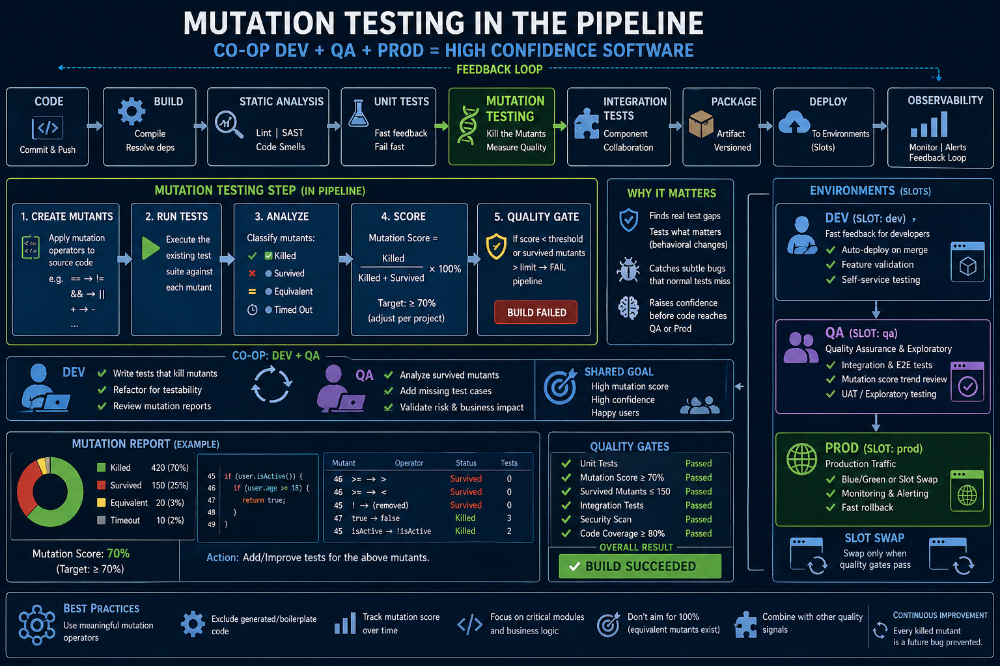

# Mutation testing - Part 2: Turn into a production-ready tool



## Mutation testing in CI/CD

In Part 1, we explored what mutation testing is and how it exposes weaknesses in test suites - from simple functions to more complex logic.

In Part 2, we move from theory to practice: **how to integrate mutation testing into the SDLC and make it work in real-world systems**.

Before we get to CI/CD, we’ll extend the state machine example - because this is where mutation testing becomes particularly powerful.

## State machines: where tests look good - but aren’t

Consider a typical state machine built with Stateless in C#:
```csharp
using Stateless;

public enum OrderState
{
    Draft,
    Submitted,
    Paid,
    Shipped,
    Cancelled
}

public enum OrderTrigger
{
    Submit,
    Pay,
    Ship,
    Cancel
}

public class OrderStateMachine
{
    private readonly StateMachine<OrderState, OrderTrigger> _machine;

    public OrderStateMachine(OrderState initialState)
    {
        _machine = new StateMachine<OrderState, OrderTrigger>(initialState);

        _machine.Configure(OrderState.Draft)
            .Permit(OrderTrigger.Submit, OrderState.Submitted);

        _machine.Configure(OrderState.Submitted)
            .Permit(OrderTrigger.Pay, OrderState.Paid)
            .Permit(OrderTrigger.Cancel, OrderState.Cancelled);

        _machine.Configure(OrderState.Paid)
            .PermitIf(OrderTrigger.Ship, OrderState.Shipped, () => IsReadyToShip())
            .Permit(OrderTrigger.Cancel, OrderState.Cancelled);
    }

    public bool IsPaid { get; set; }
    public bool IsInStock { get; set; }
    public bool IsAddressValid { get; set; }

    private bool IsReadyToShip()
    {
        return IsPaid && IsInStock && IsAddressValid;
    }

    public void Fire(OrderTrigger trigger) => _machine.Fire(trigger);

    public OrderState State => _machine.State;
}
```

### Intended behaviour

An order can be shipped only if:
- State = `Paid`
- `IsPaid == true`
- `IsInStock == true`
- `IsAddressValid == true`

### A “good” test suite

```csharp
public class OrderStateMachineTests
{
    [Fact]
    public void PaidOrder_WithValidConditions_CanShip()
    {
        var sm = new OrderStateMachine(OrderState.Paid)
        {
            IsPaid = true,
            IsInStock = true,
            IsAddressValid = true
        };

        sm.Fire(OrderTrigger.Ship);

        Assert.Equal(OrderState.Shipped, sm.State);
    }

    [Fact]
    public void CannotShip_WhenNotPaid()
    {
        var sm = new OrderStateMachine(OrderState.Paid)
        {
            IsPaid = false,
            IsInStock = true,
            IsAddressValid = true
        };

        Assert.ThrowsAny<Exception>(() => sm.Fire(OrderTrigger.Ship));
    }
}
```
This looks solid:
- Happy path ✔
- Failure case ✔

Most teams would stop here.

### Mutation testing exposes what we missed

Using Stryker.NET, we introduce small changes (mutants) and observe whether tests detect them.

#### ❌ Mutant 1: weakened condition
```   
- return IsPaid && IsInStock && IsAddressValid;
+ return IsPaid && IsInStock;
```   

- **Impact**: orders with invalid addresses can ship
- **Detected?** ❌ No

Why?
The failure test (`IsPaid = false`) fails _before_ the address condition is evaluated.

> The test passes  -  but not for the reason we think.


#### ❌ Mutant 2: logical operator flipped
```   
- return IsPaid && IsInStock && IsAddressValid;
+ return IsPaid || IsInStock || IsAddressValid;
```

**Impact**: almost any order can ship
**Detected?** ✅ Yes

#### ❌ Mutant 3: guard removed
```
- .PermitIf(OrderTrigger.Ship, OrderState.Shipped, () => IsReadyToShip())
+ .Permit(OrderTrigger.Ship, OrderState.Shipped)
```

**Impact**: shipping always allowed
**Detected?** ❌ Not reliably


#### ❌ Mutant 4: wrong transition
```
- .Permit(OrderTrigger.Pay, OrderState.Paid)
+ .Permit(OrderTrigger.Pay, OrderState.Shipped)
```

**Impact**: payment skips directly to shipping
**Detected?** ❌ No

We never tested the `Submitted → Paid` transition explicitly.


#### ❌ Mutant 5: missing transition
```
- .Permit(OrderTrigger.Cancel, OrderState.Cancelled);
+ // removed
```

**Impact**: cannot cancel after payment
**Detected?** ❌ No


#### What mutation testing reveals about state machines

Even with “good” tests, we missed:

1) Transition coverage gaps
- Not all triggers from each state were tested

2) Guard condition completeness
- We tested one failure  -  not all combinations

3) Transition correctness
- We didn’t verify where transitions lead

4) Invalid transitions
- We didn’t assert what must never happen


### Mutation-driven tests (what “good” really looks like)

#### Test guard combinations

```csharp
[Theory]
[InlineData(false, true, true)]
[InlineData(true, false, true)]
[InlineData(true, true, false)]
public void CannotShip_WhenAnyConditionFails(bool paid, bool stock, bool address)
{
    var sm = new OrderStateMachine(OrderState.Paid)
    {
        IsPaid = paid,
        IsInStock = stock,
        IsAddressValid = address
    };

    Assert.ThrowsAny<Exception>(() => sm.Fire(OrderTrigger.Ship));
}
```

#### Test transitions explicitly

```csharp
[Fact]
public void Submitted_To_Paid_WorksCorrectly()
{
    var sm = new OrderStateMachine(OrderState.Submitted);

    sm.Fire(OrderTrigger.Pay);

    Assert.Equal(OrderState.Paid, sm.State);
}
```

#### Test invalid transitions

```csharp
[Fact]
public void CannotShip_From_Draft()
{
    var sm = new OrderStateMachine(OrderState.Draft);

    Assert.ThrowsAny<Exception>(() => sm.Fire(OrderTrigger.Ship));
}
```

#### Test cancellation paths

```csharp
[Fact]
public void PaidOrder_CanBeCancelled()
{
    var sm = new OrderStateMachine(OrderState.Paid);

    sm.Fire(OrderTrigger.Cancel);

    Assert.Equal(OrderState.Cancelled, sm.State);
}
```

### The key insight

State machines introduce:
- A combinatorial explosion of transitions
- Hidden coupling between state, triggers, and guards
- A tendency to test only the “happy path + one failure”

Mutation testing forces a different mindset:
> **Every transition. Every guard. Every edge case.**

### Why this matters in modern architectures

In systems built on: 
- Azure Functions
- Azure Service Bus
- event-driven workflows
- state machines

…small logic errors can silently break entire flows.

✔ Mutation testing helps detect:
- Invalid event handling
- Incorrect transitions
- Missing guards
- Violated invariants

## From technique to practice: CI/CD integration

Mutation testing is powerful  -  but expensive.
- The goal is not to run it everywhere.
- The goal is to run it **where it matters**.

It forces developers to define **the complete behaviour of the design system—not just examples of it**.

### 1) Local setup (baseline)

```bash
dotnet tool install -g dotnet-stryker
dotnet stryker
```

This generates:
- Mutation score
- Survived mutants (most valuable insight)
- HTML reports

> Don’t focus on the score first  -  focus on what survived.

### 2) Azure DevOps pipeline integration

Keep normal unit tests fast
```yaml
- task: DotNetCoreCLI@2
  displayName: Run Unit Tests
  inputs:
    command: test
    projects: '**/*Tests.csproj'
```

Example pipeline step:
```yaml
- script: |
    dotnet tool install -g dotnet-stryker
    dotnet stryker --reporter "html" --reporter "progress"
  displayName: Run Mutation Tests
```

Publish results:
```yaml
- task: PublishBuildArtifacts@1
  inputs:
    pathToPublish: 'StrykerOutput'
    artifactName: 'mutation-report'
```

### 3) Performance strategy (critical)

> Mutation testing is computationally expensive.
>
> **Recommended approaches:**

- Nightly execution 
```yaml
schedules:
- cron: "0 2 * * *"
  displayName: Nightly Mutation Tests
```

- Main branch only
```yaml
condition: eq(variables['Build.SourceBranch'], 'refs/heads/main')
```

- Critical modules only
```bash
dotnet stryker --project "src/Domain/Domain.csproj"
```

### 4) Sensible thresholds

- Create `stryker-config.json`:

```json
{
  "thresholds": {
    "high": 80,
    "low": 60,
    "break": 50
  },
  "mutate": [
    "Domain/**/*.cs",
    "!**/Migrations/*.cs",
    "!**/Program.cs"
  ],
  "test-projects": [
    "tests/Domain.Tests/Domain.Tests.csproj"
  ],
  "parallel": true
}
```

Thresholds meaning:
- 80%+ → excellent
- 60–80% → acceptable
- <50% → fail pipeline

> **100% mutation score is not a realistic goal**.

### 5) What NOT to mutate

❌ Avoid:
- Controllers
- DTOs
- EF migrations
- Logging

✅ Focus on:
- Domain services
- State machines
- Business rules
- Validation


### 6) PR strategy (what actually works)

#### ❌ Don’t do this:
- “Fail PR if mutation score < 80%” 
- → This kills adoption.

#### ✅ Do this instead:
- Establish a baseline
- Fail only if the score drops

> This enforces: **“Don’t make test quality worse.”**


### What do teams actually gain?

Mutation testing will:
- Slow things down ❌
- Add complexity ❌

But it will also:
- Expose hidden weaknesses ✅
- Prevent false confidence ✅
- Strengthen critical logic significantly ✅

In practice:
- Unit tests answer: _“Does it work?”_
- Mutation testing answers: _“Would we notice if it broke?”_

That second question is what protects production systems.

### What are the actual benefits of integrating mutation testing into the production process?

In architectures based on:
- state machines
- event-driven workflows
- distributed services

👍 Mutation testing becomes:
> A safety net for behavioural correctness  -  not just code coverage.

It ensures:
- transitions are valid
- guards are enforced
- business rules do not silently degrade

For instance 1: event handling logic ..
```csharp
    if (event.Type == "PaymentReceived" && order.State == Submitted)
```
.. a mutation such as: `== → !=` can reveal if we missed critical conditions.

For instance 2: business invariants ..
```csharp
    if (amount <= 0) throw new Exception();
```
.. a mutation such as: `<= → <` can reveal if edge case disappears silently.


## Structuring the repository for mutation testing

> To make mutation testing sustainable, repository structure matters. Without clear boundaries, mutation testing becomes slow, noisy, and difficult to maintain.

Below is a practical structure aligned with domain-driven design and event-driven architecture.

### Suggested repository layout

```
src/
  Domain/
    OrderStateMachine.cs
    PaymentRules.cs
    Validators/
  
  Application/
    Handlers/
    Services/

  Functions/
    PaymentFunction.cs
    ShippingFunction.cs

tests/
  Domain.Tests/
  Application.Tests/
```

### Where mutation testing brings the most value

Mutation testing should not be applied uniformly across the codebase.

Focus areas (high ROI)
- **Domain layer** ✅ - Core business logic, rules, and invariants
- **State machines (e.g., Stateless)** ✅ - Transitions, guards, and workflows
- **Validation logic** ✅ - Boundary conditions and correctness rules

Conditional areas (case-by-case)
- **Application layer** ⚠️ - Only where real decision logic exists

### Avoid (low value / high noise)
- Azure Functions (thin triggers) ❌
- DTOs ❌
- Infrastructure code ❌
- Logging ❌

These layers typically:
- contain little logic
- produce many equivalent mutants
- slow down analysis without adding insight

### Production-ready Stryker configuration

Example `stryker-config.json`:

```json
{
  "$schema": "https://stryker-mutator.io/stryker.schema.json",
  "test-projects": [
    "tests/Domain.Tests/Domain.Tests.csproj"
  ],
  "mutate": [
    "src/Domain/**/*.cs",
    "!src/Domain/**/Generated/*.cs",
    "!src/Domain/**/DTOs/*.cs"
  ],
  "reporters": [
    "html",
    "progress",
    "cleartext"
  ],
  "thresholds": {
    "high": 80,
    "low": 65,
    "break": 60
  },
  "ignore-mutations": [
    "string",
    "linq"
  ],
  "ignore-methods": [
    "ToString",
    "Equals"
  ],
  "parallel": true
}
```

### Why does this structure work?

This configuration:
- Targets **high-value logic only**
- Avoids noise from generated and structural code
- Keeps execution time manageable
- Focuses mutation testing where it actually improves confidence

### How this fits into the pipeline?

With this structure:
- **Fast CI** runs unit tests across all layers
- **Mutation testing** targets only the Domain layer
- **Nightly jobs** expand coverage if needed

This ensures:
- fast feedback loops
- meaningful mutation results
- sustainable long-term usage

## Operating mutation testing in real systems

### Pull Request strategy (what actually works)

A common mistake is enforcing strict thresholds immediately:

> “Fail the PR if mutation score < 80%”

This approach almost always fails in practice.

> Don’t punish legacy code  → this is where most teams get it wrong.

Why?
- Legacy code rarely meets high thresholds
- Teams get blocked for reasons they don’t understand
- Developers start bypassing or disabling mutation testing


### A better approach: baseline + regression check

Instead of enforcing an absolute score, **enforce direction**.

**Step 1: establish a baseline**

Execute mutation testing once and store the result:
- Run locally or in pipeline: `dotnet stryker --reporter json`
- Save report: `StrykerOutput/mutation-report.json`
- Store everything in artifact or repo snapshot.

**Step 2: compare in **Pull Requests****

If:
- score drops → ❌ fail
- score improves or stays → ✅ pass

This enforces a simple rule:
> “**Don’t make test quality worse.**”

### Example (Azure DevOps script)

- Standard CI
```yaml
trigger:
- main

pr:
- main

pool:
  vmImage: 'ubuntu-latest'

steps:

- task: UseDotNet@2
  inputs:
    packageType: sdk
    version: '8.x'

- script: dotnet build --configuration Release
  displayName: Build

- script: dotnet test --configuration Release
  displayName: Run Unit Tests
```

- Mutation testing (nightly or main branch PR only)
```yaml
- script: |
    dotnet tool install -g dotnet-stryker
    dotnet stryker --reporter json --reporter html
  displayName: Run Mutation Tests
```

- Compare mutation score (custom script or extension)
```bash
#!/bin/bash

CURRENT=$(jq '.metrics.mutationScore' StrykerOutput/mutation-report.json)
BASELINE=$(jq '.metrics.mutationScore' baseline/mutation-report.json)

echo "Current score: $CURRENT"
echo "Baseline score: $BASELINE"

if (( $(echo "$CURRENT < $BASELINE" | bc -l) )); then
  echo "Mutation score dropped!"
  exit 1
fi
```

### Why this works?
- Encourages gradual improvement
- Doesn’t punish legacy systems
- Builds adoption instead of resistance

### Keeping the pipeline fast (critical in practice)

> Mutation testing can take minutes or hours. 

If not controlled, it will:
- slow down CI
- frustrate developers
- get disabled

### Practical strategies

1) Target test projects
```bash
dotnet stryker --test-projects tests/Domain.Tests/Domain.Tests.csproj
```

2) Limit scope to critical code
```bash
dotnet stryker --project src/Domain/Domain.csproj
```

3) Run only on changed code
```bash
dotnet stryker --since origin/main
```
> This is one of the highest ROI optimizations.

4) Separate execution tiers

**Fast CI (every commit):**
- build
- unit tests

**Slower CI (main branch):**
- targeted mutation testing

**Nightly:**
- full mutation suite

### Key insight

> Mutation testing is a quality gate, not a default step.

### Final architecture alignment

Mutation testing becomes truly powerful only when aligned with architecture.

In systems built on:
- Azure Functions
- Azure Service Bus
- event-driven workflows
- state machines (e.g., Stateless)

…the most critical failures come from **small logic errors **in core flows**.


### Where mutation testing gives maximum ROI

1) State machine transitions:
```csharp
    PermitIf(OrderTrigger.Ship, OrderState.Shipped, () => IsReadyToShip())
```

Mutation testing will:
- remove guards
- flip conditions
- alter transitions

2) Event handling logic
```csharp
    if (event.Type == "PaymentReceived" && order.State == Submitted)
```
Mutation:
```
== → !=
```
Without mutation testing, this can easily slip through.

3) Business invariants
```csharp
if (amount <= 0) throw new Exception();
```

Mutation:
```
<= → <
```

This removes an edge case silently.

### What should always be tested (mutation-driven mindset)

For every state:

- All valid transitions
```csharp
Submitted → Paid
Paid → Shipped
```
- All invalid transitions
```csharp
Draft → Ship (should fail)
```
- Guard permutations

> Instead of `IsPaid = false` test all combinations:

```csharp
[Theory]
[InlineData(false, true, true)]
[InlineData(true, false, true)]
[InlineData(true, true, false)]
```

### What to look for in mutation reports

Open the HTML report and scan for survived mutants. Pay special attention to:
- `&& / ||`
- `>=, <=`
- `==, !=`
- guard conditions
- state transitions

### Common patterns we’ll find
- Missing boundary tests
- Missing state combinations
- Weak assertions (tests pass for the wrong reason)

### Realistic expectations

<pre><code>
Phase	Target
--------------------
Start	50–60%
Mature	70–85%
Critical domain	80%+
</code></pre>

< [!NOTE]
> 100% mutation score is not worth the cost.

### Final architecture recommendation

Run mutation testing on:
- Domain (state machines, rules) ✅
- Event handlers with logic ✅

Skip:
- Azure Functions (thin triggers) ❌
- Infrastructure ❌


## Final takeaway

Mutation testing in real systems is not about:
- maximizing score
- running it everywhere
- enforcing strict rules

It’s about:
- protecting critical logic
- improving test sensitivity
- preventing silent regressions

When applied correctly in architectures built on:
- state machines
- event-driven systems
- distributed workflows

…it becomes:
> **A safeguard for behavioural correctness - not just test coverage.**


_In the next article in the series, I'll discuss mutation testing limits and how to go beyond it with examples._

## See also:
- [Mutation testing - Part 1](./Mutation_testing_Part_1.md)
- [Mutation testing - Part 3](./Mutation_testing_Part_3.md)
- [Mutation testing - Part 4](./Mutation_testing_Part_4.md)

- [Agile Vibe Coding Manifesto](https://agilevibecoding.org/)
- [Principles Behind the Agile Vibe Coding Manifesto - extended version](https://github.com/marekartur-dev/agilevibecoding/blob/main/Docs/Home/Principles.md)

- [Agile Vibe Coding](https://www.reddit.com/r/AgileVibeCoding/)
- [Marek Kubis - blog](https://github.com/marekartur-dev/agilevibecoding/tree/main)
