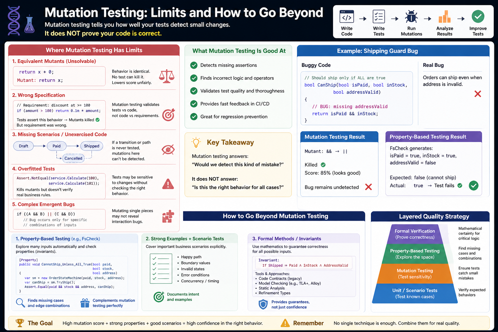

# Mutation testing - Part 3: Mutation testing limits and how to go beyond it



In Part 1, we discussed what mutation testing is and how it can reveal weaknesses in our solutions using test examples - from the simplest to the more complex. 
In Part 2, we discussed how to make mutation testing work in real-world systems. 
In Part 3, we will explore the limitations of mutation testing and how to overcome them.

Let's discuss:
- counterexamples where mutation testing hypotheses fail, and
- how to combine mutation testing with property-based testing and formal verification.

## Where mutation testing hypotheses fail

Recall the two assumptions:
- Competent Programmer Hypothesis → bugs are small
- Coupling Effect → simple bugs represent complex ones

These are useful - but not universally true.

### ❌ Counterexample 1: Equivalent mutants (unsolvable problem)

```csharp
    public int Add(int x)
    {
        return x + 0;
    }
```

Mutation: `x + 0 → x`

behaviour is identical.

What happens?
- Tests can’t kill the mutant
- Mutation score drops unfairly
- No real bug exists

> **Conclusion**: Mutation testing sometimes measures syntactic difference, not semantic ones


### ❌ Counterexample 2: Wrong specification (the dangerous one)

```csharp
    public decimal Discount(decimal amount)
    {
        if (amount > 100)
            return amount * 0.1m;

        return 0;
    }
```

> But the real requirement is: _discount applies at ≥ 100_.

Our tests:
```csharp
    Assert.Equal(10, Discount(200));
    Assert.Equal(0, Discount(50));
```

Mutation testing result:
- Mutants killed ✅
- High mutation score ✅

Reality: **Business rule is wrong** ❌

> **Conclusion**: Mutation testing validates tests vs code, **not code vs requirements**
In both cases, the observable behaviour of the unit tests remains the same.


### ❌ Counterexample 3: Missing scenarios entirely

Recall the state machine example in Part 2.

We never test: `Cancelled → Refund`

Mutation testing:
- Can’t mutate what isn’t exercised
- Reports everything “fine”

> **Conclusion**: Mutation testing cannot detect missing behaviours.
Again, the observable behaviour of the unit tests remains unchanged.


### ❌ Counterexample 4: Overfitted tests

Bad test:

```csharp
    Assert.NotEqual(service.Calculate(100), service.Calculate(101));
```

👉 The test kills mutants, but it does not validate meaningful business logic.

> **Conclusion**: We can “game” mutation testing without improving quality.


### ❌ Counterexample 5: Complex emergent bugs

The “good” test:
```csharp
    if ((A && B) || (C && D))
```

Mutation testing checks:
- A
- B
- C
- D 
individually.

But the bug might depend on a specific combination (e.g., A=true, B=false, C=true, D=false).

> **Conclusion**: Coupling Effect is not perfect - interactions matter.


## Going beyond mutation testing

To address these gaps, we combine mutation testing with:
- **Property-Based Testing** (PBT)
- **Formal verification** (next level)

### Introduction to Property-Based Testing (PBT) 

Property-based testing is based on defining **properties** - logical statements about expected behaviour - rather than individual test cases.

Instead of testing specific inputs, we define rules that should hold for all inputs, and the framework generates many test cases automatically.

> This idea originates from Haskell's QuickCheck mechanism. The programmer provides a specification of the program, in the form of properties which functions should satisfy. 
> QuickCheck then tests that the properties hold in a large number of randomly generated cases.
> 
> This approach allows developers to automatically generate test cases that verify program properties based on randomly generated input data. 
> This approach exposes edge cases that traditional unit tests might miss, increasing software robustness.

In .NET we can use the `FsCheck`. The `FsCheck` is an open-source property-based testing framework for the .NET platform. 
`FsCheck` integrates with major .NET testing frameworks such as `xUnit`, `NUnit`, and `MSTest`, and with F#-specific tools like `Expecto` and `Fuchu`. 
It offers plug-ins and helpers for these environments via `NuGet` packages (`FsCheck.Xunit`, `FsCheck.Nunit`) to streamline property discovery and reporting. 

**Current Status**

Maintained actively since 2010 through 2025, `FsCheck` continues to evolve alongside the .NET ecosystem, with ongoing community contributions and [regular updates](https://fscheck.github.io/FsCheck/).
Academic work has demonstrated its use for verifying web-service behaviour by deriving models from business-rule definitions, illustrating its adaptability to industrial scenarios in automotive and enterprise applications.
It remains a primary tool for property-based testing within .NET development.

### Example: fixing the discount problem

Instead of:
```csharp
    Assert.Equal(0, Discount(50));
```

Define a property:
```csharp
    Prop.ForAll<decimal>(amount =>
    {
        if (amount >= 100)
            return Discount(amount) > 0;

        return Discount(amount) == 0;
    });
```

**✅ What this solves**
- Explores many inputs automatically
- Finds edge cases we didn’t think of
- Covers input space, not just examples

**🔥 Combined with mutation testing**
- Mutation testing → **“Are tests strong?”**
- Property testing → **“Did we explore enough inputs?”**

### Formal verification (next level)

Formal verification defines mathematical specifications of system behaviour and proves correctness for all inputs.

In .NET, examples include:
- **Microsoft Code Contracts **(legacy)
- model checking approaches
- tools like **TLA+** and **Dafny**

### Introduction to Microsoft Code Contracts

**Microsoft Code Contracts** is a software library and toolset that brought design-by-contract principles to the .NET ecosystem. 
It enabled developers to specify preconditions, postconditions, and object invariants directly in code for static verification and runtime checking, improving program correctness and documentation.
Introduced in 2009, the last major update was in 2017, but it remains a significant example of formal verification in .NET.

Code Contracts unified various forms of program assertions under a single API. 
Using attributes and methods from the `System.Diagnostics.Contracts` namespace, developers could express conditions such as `Contract.Requires`, `Contract.Ensures`, and `Contract.Invariant`. 
These constructs defined expected behaviour for methods and objects, promoting reliability and reducing defects through explicit contracts.

Although Microsoft officially discontinued Code Contracts, the concept influenced later tools such as **Roslyn analyzers**, nullable reference analysis, and modern static analysis frameworks. 
Its design-by-contract philosophy continues to shape how correctness, specification, and verification are integrated into contemporary development practices.

### Conceptual example of formal verification 

Instead of:
```csharp
    public bool IsAdult(int age)
    {
        return age >= 18;
    }
```

Define:
```
  age ≥ 18 ⇒ IsAdult(age) = true
  age < 18 ⇒ IsAdult(age) = false
```

**✅ What this solves**
- Guarantees correctness for all inputs
- Eliminates ambiguity

**❌ Trade-off**
- Hard to write
- Requires formal thinking
- Not always practical


## The layered testing model (key idea)

Think of quality as layers:

```
Level 1: Unit Tests
  → “Does it work for known cases?”

Level 2: Mutation Testing
  → “Would we detect bugs?”

Level 3: Property-Based Testing
  → “Did we explore enough possibilities?”

Level 4: Formal Verification
  → “Is it mathematically correct?”
```

### Applying this to real systems

In systems with:
- Stateless state machines
- Event-driven workflows
- LLM-generated code

we combine approaches.

Example: 
- Mutation testing → catches missing guards.
- Property-based testing → generates combinations of `IsPaid`, `IsInStock`, `IsAddressValid`.
- Formal reasoning → defines invariants

Example invariant: 
```
Shipped ⇒ Paid ∧ InStock ∧ ValidAddress`
```

### Special note: LLM-generated code

LLM-generated code often:
- looks correct
- compiles
- passes basic tests

…but misses edge cases.

Best workflow:
```
LLM generates code
→ Property-based tests define behaviour
→ Mutation testing validates test strength
→ Human validates business rules
```

### When to use what?
```
Technique	Best for
-------------------------------------------------
Unit tests	Known scenarios
Mutation testing	Test quality
Property-based testing	Edge cases / combinations
Formal methods	Critical invariants
```

### A non-obvious question

> Is there a real bug that mutation testing misses - but property-based testing catches?
Yes.

## Example: order state machine bug

- States: `Draft → Paid → Shipped`
- Rule (important invariant): _we can only ship if `Paid`, `In stock` and `Valid address`_.
- Implementation (with a subtle bug):

```csharp
    using Stateless;

    public enum OrderState
    {
        Draft,
        Paid,
        Shipped
    }

    public enum OrderTrigger
    {
        Pay,
        Ship
    }

    public class OrderStateMachine
    {
        private readonly StateMachine<OrderState, OrderTrigger> _machine;

        public bool IsPaid { get; set; }
        public bool IsInStock { get; set; }
        public bool IsAddressValid { get; set; }

        public OrderStateMachine()
        {
            _machine = new StateMachine<OrderState, OrderTrigger>(OrderState.Draft);

            _machine.Configure(OrderState.Draft)
                .Permit(OrderTrigger.Pay, OrderState.Paid);

            _machine.Configure(OrderState.Paid)
                .PermitIf(OrderTrigger.Ship, OrderState.Shipped, CanShip);
        }

        private bool CanShip()
        {
            // 🚨 BUG: missing IsAddressValid
            return IsPaid && IsInStock;
        }

        public void Fire(OrderTrigger trigger) => _machine.Fire(trigger);

        public OrderState State => _machine.State;
    }
```
- Unit tests (typical, but incomplete):
```csharp
    using Xunit;

    public class OrderTests
    {
        [Fact]
        public void CanShip_WhenPaidAndInStock()
        {
            var sm = new OrderStateMachine
            {
                IsPaid = true,
                IsInStock = true,
                IsAddressValid = true
            };

            sm.Fire(OrderTrigger.Pay);
            sm.Fire(OrderTrigger.Ship);

            Assert.Equal(OrderState.Shipped, sm.State);
        }

        [Fact]
        public void CannotShip_WhenNotPaid()
        {
            var sm = new OrderStateMachine
            {
                IsPaid = false,
                IsInStock = true,
                IsAddressValid = true
            };

            sm.Fire(OrderTrigger.Pay); // goes to Paid anyway

            Assert.ThrowsAny<System.Exception>(() => sm.Fire(OrderTrigger.Ship));
        }
    }
```

> What’s missing?  → `IsAddressValid = false`

### Run mutation testing example (Stryker)

**Mutation**:
```
IsPaid && IsInStock
→ IsPaid || IsInStock
```

**Result**: Tests fail → mutant killed ✅
> Mutation score looks good ❗ But…
> 
> The real bug: _**IsAddressValid** is ignored_.

Mutation testing:
- cannot add missing conditions
- only mutates existing ones

💥 This is the key limitation. As we saw in counterexample 3:
> **Mutation testing cannot detect missing logic**

> **Conclusion**: bug survives undetected ❌


### Property-based test (FsCheck):

Now we define a business invariant: “Order must NOT ship if any requirement is false”.

```csharp
    using FsCheck;
    using FsCheck.Xunit;

    public class OrderPropertyTests
    {
        [Property]
        public void CannotShip_UnlessAllConditionsTrue(bool isPaid, bool isInStock, bool isAddressValid)
        {
            var sm = new OrderStateMachine
            {
                IsPaid = isPaid,
                IsInStock = isInStock,
                IsAddressValid = isAddressValid
            };

            sm.Fire(OrderTrigger.Pay);

            var canShip = true;

            try
            {
                sm.Fire(OrderTrigger.Ship);
            }
            catch
            {
                canShip = false;
            }

            var expected = isPaid && isInStock && isAddressValid;

            Assert.Equal(expected, canShip);
        }
    }
``` 

FsCheck generates:
``` 
    isPaid = true
    isInStock = true
    isAddressValid = false
``` 
**Result**:
``` 
Expected: false
Actual: true
``` 
→ Failure `IsAddressValid = false` detected ✅ 

> **Conclusion**: 💥 TEST FAILS → bug found ✅

### Side-by-side
``` 
Technique	Result
-------------------------------------
Unit tests	❌ Missed bug
Mutation testing	❌ Missed bug
Property-based testing	✅ Found bug
``` 

**Why FsCheck caught it?**
> Because it **explores combinations** that we haven’t thought about **systematically**.

**Why mutation testing missed it?**
> Because mutation testing mutates existing code and does NOT:
> - invent missing conditions,
> - explore unseen input combinations.

If we fix the code 
```csharp
    private bool CanShip()
    {
        return IsPaid && IsInStock && IsAddressValid;
    }
``` 

and re-run everything then
``` 
Technique	Result
-------------------------------------
Unit tests	✅ Passed
Mutation testing	✅ Higher score
Property-based testing	✅ Found bug
``` 

## Final mental model

- Mutation testing → **“Would we detect mistakes in what we wrote?”**.
- Property-based testing → **“Did we forget something entirely?”**.

This means for tested systems that:
- Mutation testing: **protects code against incorrect logic**
- Property-based testing: **protects code against incomplete logic**.

Moreover, by analyzing software testing from multiple perspectives, we can also see a fundamental flaw in the commonly used approach:

> “Let’s write the program first—and then test it.”

With this mindset, we can only test what already exists. What is missing remains invisible—and missing logic is often **the most dangerous class of bugs**.

In such cases, developers validate the implementation, but not necessarily the intended behaviour.

Experienced engineers will recognize that this aligns with approaches such as Behaviour-Driven Development and Domain-Driven Design.

The key idea is simple:
- define expected behaviour first
- express it as tests or specifications
- implement code to satisfy those constraints

This is particularly relevant when comparing:
- property-based testing, which helps detect missing logic after the fact
- versus test-first approaches, where expected behaviour is defined upfront

In many cases, defining behaviour early (e.g., based on a clear set of requirements) is significantly cheaper than discovering gaps later through exhaustive test generation.

An additional benefit is alignment with principles such as **YAGNI** (**You Aren’t Gonna Need It**) - by focusing only on explicitly required behaviour, we avoid implementing unnecessary features.


## Final takeaway

The most dangerous bugs 
- are not: “wrong logic”
- but: “missing logic”

And:
> Mutation testing won’t save us from those - property-based testing will.


_In the next article in the series, I'll cover an AI/LLM area._

## See also:
- [Mutation testing - Part 1](./Mutation_testing_Part_1.md)
- [Mutation testing - Part 2](./Mutation_testing_Part_2.md)
- [Mutation testing - Part 4](./Mutation_testing_Part_4.md)

- [Agile Vibe Coding Manifesto](https://agilevibecoding.org/)
- [Principles Behind the Agile Vibe Coding Manifesto - extended version](https://github.com/marekartur-dev/agilevibecoding/blob/main/Docs/Home/Principles.md)

- [Agile Vibe Coding](https://www.reddit.com/r/AgileVibeCoding/)
- [Marek Kubis - blog](https://github.com/marekartur-dev/agilevibecoding/tree/main)
