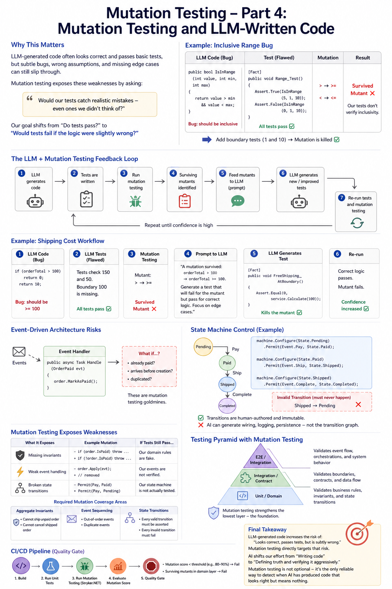

# Mutation testing - Part 4: mutation testing and LLM-written code.



In Part 1, we discussed what mutation testing is and how it can reveal weaknesses in our solutions using test examples—from the simplest to the more complex.
In Part 2, we explored how to make mutation testing work in real-world systems.
In Part 3, we discussed the limitations of mutation testing and how to overcome them.

In Part 4, we continue exploring mutation testing in the context of AI-written code.

So, how do we test the code we ask AI to write?

The answer is simple: we test it the same way we test code written by humans.

We write tests for it, and then run mutation testing to determine whether our tests are strong enough to catch potential issues. 
The difference is that we need to test it more defensively and in a more behavior-focused way. 
Mutation testing becomes even more valuable here because the failure modes are often subtle.

Tools like Stryker.NET effectively act as a sanity check for correctness assumptions.

In this article, “LLM” and “AI” are used interchangeably.

## The core problem with LLM-written code

When code is written by an LLM:
- It often looks correct ✅
- It passes basic tests ✅

However, it may still contain:
- off-by-one errors
- incorrect assumptions
- missing edge cases
- flawed business rules

In other words, this is exactly the kind of code mutation testing is designed to challenge.

### Key difference vs human-written code

With human code: we test what the developer intended.

With LLM code: we must verify what the code actually does.

Instead of trusting:
- the prompt
- the generated code
- the initial tests

In other words, when creating software, we should apply the Behavior-Driven Development and Domain-Driven Design methodologies, which was already mentioned in the previous article in the series.

Why? Because:
- The “intent” might be wrong or ambiguous
- The implementation might subtly drift from requirements


However, by making the above assumption, we create an additional problem. Why? Because behavior-driven development and domain-driven design methodologies rely heavily on intentional design. 
When we also realise that business logic is primarily event-driven and state machines, we have a very difficult combination of requirements. 
Why? Because code generated by AI tends to be pattern-complete but lacking in intent.

If safeguards are not implemented, the result will be something that looks correct but is semantically fragile – and mutation testing will quickly reveal this. 
This concern is also reflected in discussions suggesting that AI code generation has been overestimated in practice.

Let's analyse this in practice, step-by-step.


### Example

**Prompt**: “Write a method that returns true if a number is within range (inclusive)”

**Generated code**:
```csharp	
    public bool IsInRange(int value, int min, int max)
    {
        return value > min && value < max;
    }
```

**Bug**:
- Should be inclusive
- But uses strict comparison

**Tests**:
```csharp
    [Fact]
    public void IsInRange_Should_Return_True_For_Inclusive_Range()
    {
        Assert.True(IsInRange(5, 1, 10));
        Assert.False(IsInRange(0, 1, 10));
    }
``` 

**Results**:
- 👉 All tests pass ✅
- 👉 Bug survives ❌

**Mutation**:
``` 
    > → >=
    < → <=
``` 

**Results**:

If tests still pass we immediately know:
> **“Our tests don’t verify inclusivity”**

### The new testing mindset for LLM code

We need to shift: 
- from: **“Do tests pass?”**
- to: **“Would tests fail if the logic were slightly wrong?”**


### Practical strategy

1) Treat LLM code as untrusted input, especially for critical logic:
- user input
- external API

👉 **Always verify behavior thoroughly**

2) Write tests BEFORE trusting the code, even if LLM generated both:
- Review tests critically
- Add missing cases manually

Focus on:
- boundaries
- invalid inputs
- combinations

3) Use mutation testing as a quality gate

> Run Stryker.NET and ask: **“What mistakes could exist that my tests wouldn’t catch?”**

4) Focus on specification completeness

> Verify the code, because LLMs often implement a solution, but **not the correct solution**.

Mutation testing helps verify:
- edge cases
- invariants
- constraints


## LLM-specific testing patterns

### Boundary amplification

If LLM gives:
```csharp
    Assert.True(IsInRange(5, 1, 10));
```

You add:
```csharp
    Assert.True(IsInRange(1, 1, 10));   // lower bound
    Assert.True(IsInRange(10, 1, 10));  // upper bound
```

### Property-based thinking

Instead of examples:
```csharp
    Assert.True(IsInRange(x, min, max));
```

Think, for ALL x:
```csharp
    if (x >= min && x <= max) => true
    else => false
```

### Mutation-guided refinement

Workflow:
- Generate code with LLM
- Generate initial tests (LLM or manual)
- Run mutation testing
- For each survived mutant add a test or fix logic

👉 **Repeat until confidence is high**

## Where this is critical

### LLM code is especially risky in:
- Business rules (pricing, eligibility)
- State machines (like your Stateless workflows)
- Data validation
- Security checks

👉 **Exactly where mutation testing shines**

### What mutation testing WON’T fix and important to check

Mutation testing:
- ✔ Finds weak tests
- ✔ Reveals missing cases

But it does NOT:
- ❌ Verify business requirements are correct
- ❌ Detect misunderstood specs
- ❌ Guarantee correctness

### Essential to test for LLM-generated code

Combine tests and use:
1. Unit tests → correctness
2. Mutation testing → test quality
3. Integration tests → system behavior
4. Domain validation → business truth

### Advanced: if applicable test the LLM itself 

If system uses LLMs, not just generates code:
- prompt behavior
- output constraints
- failure modes

> Mutation idea here becomes: **“What if the model output is slightly wrong?”**

Example:
- missing field
- incorrect enum
- malformed JSON


## A real, end-to-end workflow example

### Step 1: LLM generates code (with a subtle bug)

**Prompt**:
```
    “Create a method that calculates shipping cost.
    - Free if order ≥ 100
    - Otherwise £10”
```

**Generated code**:
```csharp
    public class ShippingService
    {
        public decimal Calculate(decimal orderTotal)
        {
            if (orderTotal > 100)
                return 0;

            return 10;
        }
    }
```

👉 **Bug**: 
- > 100 instead of >= 100

### Step 2: LLM generates tests (also flawed)

```csharp
    public class ShippingServiceTests
    {
        [Fact]
        public void FreeShipping_WhenAboveThreshold()
        {
            var service = new ShippingService();
            Assert.Equal(0, service.Calculate(150));
        }

        [Fact]
        public void PaidShipping_WhenBelowThreshold()
        {
            var service = new ShippingService();
            Assert.Equal(10, service.Calculate(50));
        }
    }
```

- 👉 Everything passes ✅
- 👉 Bug is still there ❌

### Step 3: Run mutation testing

_Using Stryker.NET:_

**Mutant**: `> → >=`

**Result**: 👉 Survived mutant

**Meaning**: “Our tests don’t care about the boundary (100)”

### Step 4: Feed surviving mutant back into AI

_This is where the workflow becomes modern and powerful._

**AI Prompt**:

```
    “A mutation survived:
        Original: orderTotal > 100
        Mutant: orderTotal >= 100

    Current tests don’t fail.
    Generate a test that would kill this mutant.”
```

### Step 5: AI generates improved test

```csharp
    [Fact]
    public void FreeShipping_AtBoundary()
    {
        var service = new ShippingService();
        Assert.Equal(0, service.Calculate(100));
    }
```

### Step 6: Re-run mutation testing

**Now**:
- Original → returns 10 ❌
- Mutant → returns 0 ✅

**Result**: 👉 Test fails → mutant is **killed**

### Example description

We created a loop:

`LLM code → tests → mutation testing → AI fixes tests → stronger tests`

> This is **far more robust** than: “LLM writes code + tests and we trust it”


## Automating the loop

### Pipeline concept
```
    1. Generate / modify code
    2. Run unit tests
    3. Run mutation testing
    4. Parse surviving mutants
    5. Feed mutants into LLM
    6. Generate new tests
    7. Re-run tests
```

### Example mutant (from report)
```json
    {
      "file": "ShippingService.cs",
      "line": 5,
      "original": "orderTotal > 100",
      "mutated": "orderTotal >= 100"
    }
```

### Prompt template for AI

```
    We are improving a C# unit test suite.

    A mutation survived:
    - Original code: orderTotal > 100
    - Mutated code: orderTotal >= 100

    The current tests did not fail.

    Write a unit test (xUnit) that will fail for the mutant but pass for correct logic.
    Focus on edge cases.
```

### LLMs pros & cons 

**LLMs are**:
- Good at generating examples
- Bad at anticipating all edge cases

**Mutation testing**:
- Finds the missing cases

**AI**:
- Fills the gap

👉 This creates a **self-correcting system**

**Warning**:
- Don’t blindly accept generated tests.
- Always validate: does the test reflect real business rules?
- Ask: is it meaningful, or just killing the mutant artificially?

### ❌ Bad AI-generated test example

```csharp
    Assert.NotEqual(service.Calculate(100), service.Calculate(101));
```

👉 Kills mutant, but:
- Doesn’t express business intent
- Hard to maintain

### ✅ Good test example
```csharp
    Assert.Equal(0, service.Calculate(100));
```

👉 Clear rule: “Shipping is free at £100”


### State machine LLM code testing

**Example mutant**:
```
    IsPaid && IsInStock && IsAddressValid
    → IsPaid && IsInStock
``` 

**AI prompt**:
``` 
    “A guard condition lost IsAddressValid.
    Generate a test that ensures shipping fails when address is invalid.”
``` 

**Generated test**:
```csharp
    [Fact]
    public void CannotShip_WhenAddressInvalid()
    {
        var sm = new OrderStateMachine(OrderState.Paid)
        {
            IsPaid = true,
            IsInStock = true,
            IsAddressValid = false
        };

        Assert.ThrowsAny<Exception>(() => sm.Fire(OrderTrigger.Ship));
    }
``` 

## Fully automated mutation + AI loop

We can build a service that:
1. Runs Stryker.NET
2. Extracts surviving mutants
3. Calls LLM API
4. Generates test PR

### Example architecture
- Azure Function, triggered after CI
- Reads mutation report
- Calls LLM
- Creates PR with new tests

### Trade-offs

**✅ Pros**
- Finds real gaps automatically
- Improves LLM-generated code quality
- Reduces human blind spots

**❌ Cons**
- Can generate noisy tests
- Requires review discipline
- Adds pipeline complexity

### Final mental model

For LLM-generated code:

``` 
    Unit tests = “Does it work?”
    Mutation testing = “Would we notice if it didn’t?”
    AI loop = “Fix what we missed automatically”
``` 

### Something that traditional development never had

**The combination**:
- LLM (generation)
- Mutation testing (validation)
- LLM again (repair)

**creates**: 
- A closed feedback loop for correctness


## Domain-Centric Design (DDD) with AI in the loop

### The core problem with AI-generated domain code

> Let's summarise what we know and have established so far.

AI agents are good at:
- Producing syntactically valid aggregates, handlers, and transitions
- Following known frameworks (e.g., MediatR, MassTransit, Stateless)

AI agents are less effective at:
- Preserving **ubiquitous language**
- Enforcing **true invariants**
- Modeling **edge-case transitions**
- Understanding **what must never happen**

Conclusions: 
- our architecture must **force correctness outward**, 
- not trust the generated code.

### Strategy: Lock the domain and let AI fill the edges

We don’t let AI “design the domain”. We let it:
- Implement within constraints
- Generate boilerplate around a human-defined core

**Define domain contracts manually**:
- Aggregates
- Value objects
- Domain events
- State machine definitions

**Example (state machine intent)**:
``` 
    State: Order
    States: Pending → Paid → Shipped → Completed
    Invalid: Shipped → Pending (must never happen)
``` 

> This is our source of truth, not the generated code.

**Use AI to generate**:
- Event handlers
- Integration adapters
- DTO mappings
- Infrastructure glue

But never:
- Core invariants
- Transition rules
- Domain policies

### Event-Driven Architecture Case

In event-driven systems, correctness depends on:
- **Event meaning**, not just structure
- **Ordering assumptions**
- **Idempotency rules**

AI often generates handlers like:

```csharp
    public async Task Handle(OrderPaid evt) {
        order.MarkAsPaid();
    }
``` 

Looks fine, but:
- What if already paid?
- What if payment arrives before creation?
- What if duplicated?

> These are **mutation testing goldmines** and where AI fails silently.

### State Machines

> State machines are the best control mechanism and our strongest defense against AI drift.

Define transitions explicitly:
``` 
    machine.Configure(State.Pending)
        .Permit(Event.Pay, State.Paid);

    machine.Configure(State.Paid)
        .Permit(Event.Ship, State.Shipped);
``` 

> Now **AI cannot “invent” **transitions - it **must comply**.

**Key rule**:
- The state machine definition must be **human-authored and immutable**

AI can generate:
- Wiring
- Logging
- Persistence

But not:
- Transition graph

### Mutation Testing: our truth detector

Mutation testing (e.g., with Stryker.NET) answers:
> “Does your test suite actually understand your domain?”

This is where AI-generated code usually collapses.

#### What mutation testing exposes in AI code?

1) Missing invariants

**Mutation**:
``` 
    - if (order.IsPaid) throw ...
    + if (!order.IsPaid) throw ...
``` 

> If tests still pass → our **domain rules are fake**.

2) Weak event handling

**Mutation**:
``` 
    - order.Apply(evt);
    + // removed
``` 

> If tests pass → our events are **not verified**.

3) Broken state transitions

**Mutation**:
``` 
    - Permit(Pay, Paid)
    + Permit(Pay, Pending)
``` 

> If tests pass → our  state machine is **not actually tested**.

#### Required mutation coverage areas

We must target:

1) **Aggregate invariants**
- “Cannot ship unpaid order”
- “Cannot cancel shipped order”

2) **Event sequencing**
- Out-of-order events
- Duplicate events

3) **State transitions**
- Every transition must be asserted
- Every invalid transition must fail

### How to structure tests for AI-generated systems

#### Specification-style tests (critical)

> Instead of testing methods, **test business rules**:

```csharp
    [Fact]
    public void Cannot_ship_before_payment()
``` 
These survive AI rewrites.

#### Event-driven test style

```csharp
    Given(OrderCreated)
    When(OrderShipped)
    Then(Exception)
``` 

This aligns with:
- Event sourcing
- State machines
- Mutation testing

#### Transition coverage matrix

Explicitly test:

``` 
    From State	Event	Expected
    Pending	    Pay	    Paid
    Paid	    Ship	Shipped
    Pending	    Ship	❌ Fail
``` 

> AI will never generate this fully - developer must.

### Pipeline integration (CI/CD)

In our Azure DevOps pipeline:
- Run unit tests
- Run mutation testing
- Fail build if:
  - Mutation score < threshold (e.g., 80–90%)
  - Surviving mutants in domain layer

This is where architecture like Azure Function + Service Bus + Kubernetes becomes powerful:
- Mutation tests validate domain correctness
- Integration tests validate event flow correctness

### Practical workflow with AI

**Step 1** — Human defines:
- Domain model
- State machine
- Invariants

**Step 2** — AI generates:
- Handlers
- Messaging glue
- Boilerplate

**Step 3** — Developer enforces:
- Mutation testing
- Spec-based tests

**Step 4** — Iterate:
- Surviving mutants → refine tests or domain


## Final takeaway

I will repeat it, even if it is already known.

> LLM-generated code increases the risk of: “Looks correct, passes tests, but is subtly wrong”

> Mutation testing directly targets that risk by asking: “Would our tests catch realistic mistakes - even ones we didn’t think of?”

AI shifts our effort 
- from: “Writing code”
- to: “Defining truth and verifying it aggressively”

> Mutation testing is not optional here - it’s the **only reliable way** to detect when AI has produced code that _looks right but means nothing_.

**Finally, I can only encourage everyone: Developers + Testers + DevOps, strengthen your collaboration, because AI poses new, difficult challenges for software engineering.**

## See also:
- [Mutation testing - Part 1](./Mutation_testing_Part_1.md)
- [Mutation testing - Part 2](./Mutation_testing_Part_2.md)
- [Mutation testing - Part 3](./Mutation_testing_Part_3.md)

- [Agile Vibe Coding Manifesto](https://agilevibecoding.org/)
- [Principles Behind the Agile Vibe Coding Manifesto - extended version](https://github.com/marekartur-dev/agilevibecoding/blob/main/Docs/Home/Principles.md)

- [Agile Vibe Coding](https://www.reddit.com/r/AgileVibeCoding/)
- [Marek Kubis - blog](https://github.com/marekartur-dev/agilevibecoding/tree/main)
